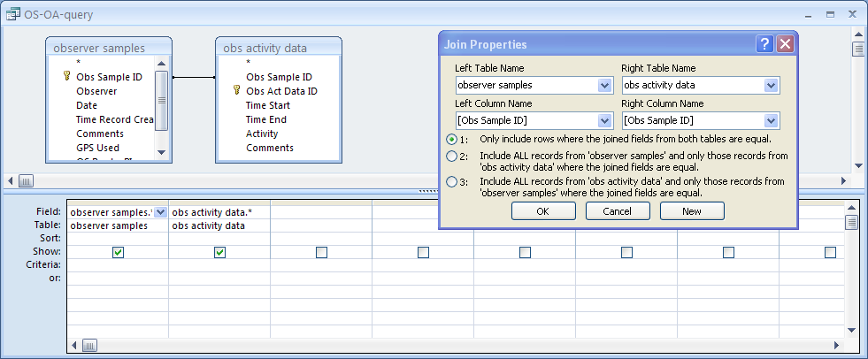
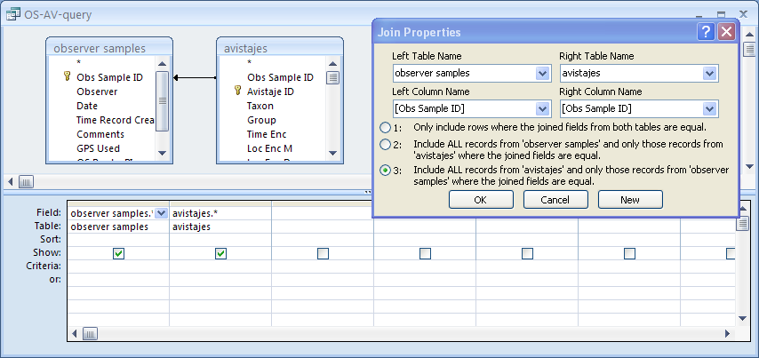
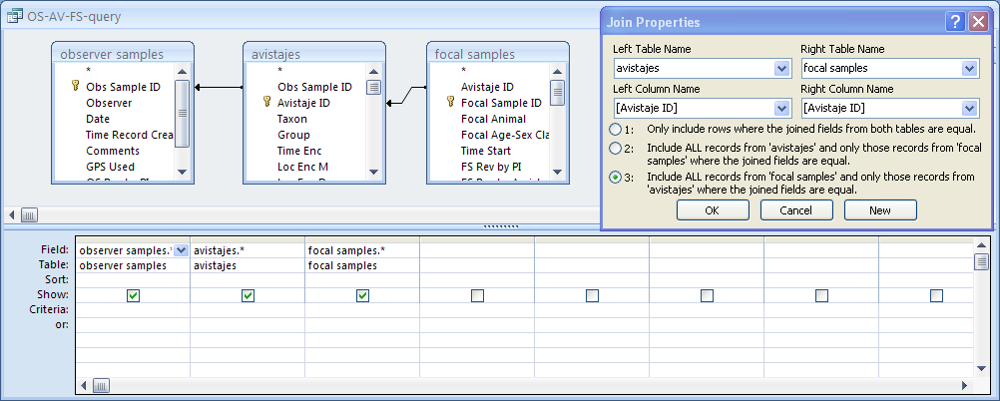

# WRITING THE MONTHLY REPORT

### Version 2017-11-25

## INSTRUCTIONS

Writing a monthly report is mandatory for everyone participating on one of the *Proyecto Primates* projects in Ecuador. The report should not exceed ten pages in length, including quantitative tables generated by the code below but excluding any attached documents (photos, videos, etc.).

As of 2017-11, three separate reports should be done each month, one for the *Comparative Monogamy Project* (sent to Anthony Di Fiore, Max Snodderly, and Eduardo Fernandez-Duque) and one each for the woolly and spider monkey portions of the *Ateline Project* (sent to Anthony Di Fiore, Andres Link, Krista Milich, and Clara Scarry).

The report(s) should be sent before the 7th day of the month following the month that is being reported, and the associated databases should be uploaded by that date as well. We will acknowledge receiving it within a few days, and if you do not get the acknowledgement be sure to send the report again!

The narrative portions of the report should written in PLAIN TEXT using a text editor (e.g., `Notepad++`, `TextWrangler`) and then pasted into the appropriate sections of the generated `.docx` file. Any extra tables or figures you create can be exported from `R` and pasted into the appropriate sections of the report. The report should be saved with under the filename indicated below: 

- For the *Comparative Monogamy Project*: "MONTHLY REPORT YYYY-MM-DD - Comparative Monogamy Project"
- For the woolly monkey portion of the *Ateline Project*: "MONTHLY REPORT YYYY-MM-DD - Lagothrix Project"
- For the spider monkey portion of the *Ateline Project*: "MONTHLY REPORT YYYY-MM-DD - Ateles Project"

While the narrative parts of your report can be in Spanish, the filename MUST be written in English and follow the convention above EXACTLY.

> NOTE: Reports must be done based on information already entered, organized, and cleaned in the *Proyecto Primates Main Database*. The `R` code included below works on queries/tables exported from the database in `.xlsx` format.

Reports should be prepared JOINTLY by all of the individuals responsible for project activities during the month that is being reported, and the names of all those contributing to data collection and to preparation of the report should be included. Reports should be prepared following a team meeting that takes place during the very first few days of the month. We want to “force” each team to get together for lunch or dinner or something to stop and think, to exchange ideas about what went well and what did not go as well the previous month, and to plan collectively for the following month. Such a meeting helps the project *and* helps you become better scientists.

The report will have the following sections:


### 1. HEADER SECTION

The Header section of the report shoud include the following information:

**Date Reported:** YYYY-MM-DD

Always use this convention for writing dates!

**Contributors:** List the full names of all people involved in collecting data this month and preparing the report. Names should be separated by slashes ("/") with a slash at the end of the last name, just like they are entered in our iOS data collection devices


### 2. GENERAL SUMMARY SECTION

The General Summary section of the report should have the following components:

2.1 - Narrative Overview - A brief narrative describing the main highlights of the team's activities and observations during the month, e.g., what areas the groups under study were using, comments on the general weather during the month, general observations about sexual activity, births, infant behavior, etc.

2.2 - Observer Activity Summary - A set of summary tables reporting general information on the activities of *each person* on the project, including dates at the station and number of OSs. This should be generated using `R` code (see below).

2.3 - Avistajes Summary - A set of summary tables reporting general information on the data collected by *each person and team*, including dates, number of AVs collected, and total AV duration. This should be generated using `R` code (see below). Also, if appropriate, include brief comments on notable observations made in the context of particular avistajes.

*Example:*

> "AV08140 (2017-09-12) - During this avistaje, I noted the presence of someone whom I think is a new individual in the group. This is a young adult female. She was seen approaching and attempting to groom my focal animal, Cuenca, during one of my focal samples (FS20016)."

2.4 - Focal Sample Summary - A set of summary tables reporting general information on the data collected on each focal animal, including dates, number of FSs collected, and total FS duration. This should be generated using `R` code (see below). Also, if appropriate, include brief comments on notable observations made in the context of particular focal samples.

*Example:*

> "FS99234 (2017-09-12) - Sofia, the subject of this focal follow, was seen soliciting two different males in short succession... first Ayax and then Mono."


### 3. DEMOGRAPHY SECTION

3.1 - Narrative Overview - Short text sections describing any significant demographic changes to any of your study groups. The report should include *each* of the subsections below. If a section is not relevant, indicate *NOT APPLICABLE*.

**Births:** (include the date the mother was LAST SEEN without an infant and the date she was FISRT SEEN within an infant)

**Deaths:** (include the date the body was recovered and describe what was done with the collected materials)

**Disappearances:** (include the date the individual was LAST SEEN)

**Immigrations:** (include the date the individual was FIRST SEEN and a description of the individual)

**Emigrations:** (include the date the individual was LAST SEEN in its old group, the date it was FIRST SEEN as a solitary animal, and the date is is FIRST SEEN in a new group, as well as the names of the relevant groups)

> **NOTE:** Be sure to always use `YYYY-MM-DD` format for dates! It is also helpful to include the AV numbers for relevant avistajes.

*Examples:*

> **Deaths**
> "2005-09-12 (AV08140) While doing routine demography work I picked up a dead signal on the Jojo's collar (faster beep rhythm). Found the collar (black Holohil ateline collar with blue diamond tag, antenna left side, frequency 148.051) on the ground, intact, with clumps of brown fur nearby. No bones or body parts found, however."

> **Emigrations**
> "Ceiba was last seen in the group on 2008-10-26 (AV54423). She was first seen traveling alone on 2008-10-30 (AV54427)."

3.2 - Demography Summary - A summary table of the demography of *each* of the groups under study. This should be generated using `R` code (see below).


### 4. COLLECTIONS AND MARKED TREES SECTION

4.1 - Biological Samples - A summary table of the *biological samples* collected that month from the groups and individuals under study. This should be generated using `R` code (see below).

4.2 - Marked Trees - A summary table of any *new* trees marked during this month. This should be generated using `R` code (see below).


### 5. SPECIFIC DATA SECTIONS

When important events of the kinds enumerated below are witnessed (for example a fight between two groups), a brief, yet detailed, *narrative description* of the event should be included in the report. As you prepare each section, you should to relate this narrative to corresponding records in the *Proyecto Primates Main Database*, but you should not simply be copying records from the database or including simply lists of events that can be found in the database from a simple query. The goal of the qualitative, narrative text is to provide additional details and contextual information about events that are hard to express in the formal structure of the database.

Intergroup Encounters
Dispersal
Adult Replacement
Vocalizations
Sexual Behavior
Anything else remarkable or unusual


### 6. LOGISTICS AND ISSUES SECTION

The final sections of the report should be used for reporting on movements of personnel in and out of the station, equipment or computer issues, data management problems, permit issues, outreach activities, etc.

You should include here any requests for supplies as well as DETAILS of any problems with equipment. Be sure to send us requests for supplies with ENOUGH LEAD TIME for us to get them and send them with the next folks coming to the field. Far too frequently, we are asked to buy supplies when there are no supplies left already!

- Travel Dates

Provide dates of travel in or out of the station for any project personnel this month. This should match information in the database!

*Examples:*
> 2017-06-02 - Laura Abondano traveled IN to station
> 2017-06-02 - Natalia traveled IN to station
> 2017-06-11 - Cristian Alvarado traveled OUT of station for vacation
> 2017-06-11 - Samantha Rettke traveled OUT of station for vacation
> 2017-06-11 - Laura Gomez traveled OUT of station for vacation
> 2017-06-18 - Cristian Alvarado traveled IN to station
> 2017-06-18 - Samantha Rettke traveled IN to station
> 2017-06-21 - Laura Gomez traveled IN to station

- Data Collection and Management Issues

Describe any particular situation regarding data collection and management such as an iPod not functioning (further detail on this topic should appear in the LOGISTICS section), somebody losing data or a databook, etc. Be as detailed as possible on what the issue is so that the project directors can understand the issue and, down the road, take it into account when doing data analyses.

- Equipment Problems

- Outreach Activities

Provide a short summary of any outreach activities that project personnel engaged in during the month, e.g., giving talks or demonstrations for visiting student groups, taking visiting photographers/videographers/students to the field to visit monkeys, etc. For each activity, note the date, who from the project participated, the nature of the activity, who the audience was, and about how many attendees.

*Examples:*

> "2017-06-05 - Tony gave an evening talk overviewing various Proyecto Primates projects, in Spanish, for a visiting group of about 20 students from Georgetown University" > "2017-06-22 - Cristian and Laura brought a group of 3 students from the Ceiba Tropical Ecology field course with them to follow spider monkeys for the day."

- Supplies Needed

## `R` CODE

The `R` code blocks below will help you generate the sections, tables, and figures needed for the monthly report.

```{r Setup, include=FALSE}
knitr::opts_chunk$set(echo = TRUE)

# Specify timezone... this can be modified for other study sites
timezone <- "America/Bogota"

# Specify offset from GMT... this can be modified for other study sites
offsetFromGMT <- -5

# Set the TZ for the current environment to the timezone specified above
Sys.setenv(TZ=timezone)
# NOTE: Sys.setenv needs to be run before the lettercase package is loaded

# Load all required packages and functions
source("monthly report source.R")
report_doc <- read_docx("report template.docx") # creates an rdocx object from the report template for output to a .docx file
```

### Generating Section 1 - Header

```{r Header}
# This code sets up observers, dates, taxa of interest, etc.
# First, we clear out header information and vectors used for limiting observers, date ranges, and taxa from R
# NOTE: A warning is given if these variable are not already present
rm(list=c("reportDate", "contributors", "observers","dateRange","taxa")) 

# Set report date
reportDate <- "2017-11-25"

# Set a vector of contributors
contributors <- c("Laura Gomez", "Cristian Alvarado")

# Set a vector of observers
observers <- c("Laura Gomez", "Cristian Alvarado")

# Set a vector with start and end date of range
dateRange <- c("2017-07-01", "2017-07-31") # a start and end date

# Set a vector of taxa to consider
taxa <- c("Ateles")

# Set a vector of groups to consider
groups <- c("Ateles MQ-1")

# Uncomment the lines below for a interactive selection of observer names from a list
# NOTE: This will not work when knitting, so is not recommended

# os <- read_xlsx("data/observer samples.xlsx", guess_max = 10000)
# observers <- as.character(obsEntryDialog(os$Observer))
# observers

# Uncomment the lines below for interactive selection of dates to consider from a list
# NOTE: This will not work when knitting, so is not recommended

# os <- read_xlsx("data/observer samples.xlsx", guess_max = 10000)
# dateRange <- as.character(as.Date(as.numeric(dateRangeEntryDialog(os$Date))/86400,origin = "1970-01-01"))
# dateRange

contributorsList <- NULL
for (i in contributors){contributorsList <- paste0(contributorsList,i,"/")}

report_doc <- report_doc %>%
	body_add_par("Header", style="heading 1", pos="after") %>%
	body_add_par(paste0("Date Reported: ", reportDate),style="heading 2") %>%
	body_add_par(paste0("Contributors: ", contributorsList),style="heading 2")
```

### Generating Section 2.1 - General Summary: Narrative Overview

```{r General Summary: Narrative Overview}
report_doc <- report_doc %>%
	body_add_par("General Summary", style="heading 1", pos="after") %>%
	body_add_par("Narrative Section", style="heading 2", pos="after") %>%
	body_add_par("<FILL IN THIS SECTION>", style="Normal")
```

### Generating Section 2.2 - General Summary: Observer Activity

- Open the *Proyecto Primates Main Database* and query the `observer samples` and `observer activity data` for data collected during the month in question. Set up the query as an "inner join" query (i.e., under join properites, select [1], i.e., "include rows where the joined fields from both tables are equal"...



- Export the resulting query as "OS-OA-inner-join-query.xlsx" in `.xlsx` format.

- Move the file into the "data" directory inside directory with this document ("monthly-report").

- Open `R` and run the following code:

```{r General Summary: Observer Activity}
# The following code parses the results of a regular query (inner join) of `observer samples` and `observer activity data`
# Here, we start with a query of the two tables in Access...

d <- read_xlsx("data/OS-OA-inner-join-query.xlsx", guess_max = 10000) # guess max set close to length of file
d <- rename(d, `Obs Sample ID` = `observer samples_Obs Sample ID`)
d <- select(d, -`obs activity data_Obs Sample ID`)
```

- Alternatively, open the *Proyecto Primates Main Database* and export the `observer samples` and `obs activity data` tables.

- We can then do the inner join directly in R...

```{r General Summary: Observer Activity}
os <- read_xlsx("data/observer samples.xlsx", guess_max = 10000) # guess max set close to length of file
oa <- read_xlsx("data/obs activity data.xlsx", guess_max = 30000) # guess max set close to length of file
d <- inner_join(os, oa, by = "Obs Sample ID")
```

This process will give us the same result as doing the inner join query in Access, BUT we don't wind up with two variables for Obs Sample ID so the `rename` step in the chunk above isn't necessary, nor is the `select` step to drop the second Obs Sample ID variable.

> NOTE: We could also use a "right_join" to return all rows of `obs activity data` plus matching rows of `observer samples`; these *should* be equivalent to the "inner_join" as `obs activity data` should always have an `observer sample` parent!

```{r General Summary: Observer Activity}
d <- rowid_to_column(d, "rowID")
vars <- c("rowID", "Obs Sample ID", "Observer", "Date", "GPS Used", "Time Start", "Time End", "Activity")
d <- select(d, vars)
d <- arrange(d, `Observer`, `Date`, `Obs Sample ID`, `Time Start`)

if (length(observers) > 0) {d <- filter(d, `Observer` %in% observers)}
if (length(dateRange) > 0) {d <- filter(d, Date >= dateRange[1] & Date <= dateRange[2])}

d <- fixdate(d, datefield="Date")
d <- fixtime(d, datefield="Date", timefield=c("Time Start", "Time End"), offsetFromGMT, timezone)

d <- mutate(d, Duration=`Time End`-`Time Start`)
units(d$Duration) <- "secs"
d <- mutate(d, `General Activity` =
							ifelse(grepl("Field work", `Activity`), "Field Work",
							ifelse(grepl("Camp - personal", `Activity`), "Camp - Personal",
							ifelse(grepl("Camp - project work", `Activity`), "Camp - Project",
							ifelse(grepl("Travel", `Activity`), "Travel",
							"Other")))))

# Now, we find records where the duration of an observer activity is <= 0 seconds... these should be checked and corrected in database!

warnings <- d %>% filter(Duration <= 0 | is.na(Duration))

if (!is.null(warnings)) {
	print("WARNING: Check the following rows of observer activity data as the start and end times entered imply that the activity lasted 0 seconds or less! or that either Time Start or End = NA!")
	print(warnings)
	}

d <- d %>% filter(Duration > 0 ) # this keeps only lines with duration > 0

output <- d %>% group_by(`Observer`, `Date`, `Obs Sample ID`, `General Activity`) %>% summarize(`Duration` = sum(`Duration`, na.rm = T)) %>% spread(`General Activity`, `Duration`, fill = 0, convert = FALSE) %>% mutate(`Total`=`Camp - Personal` + `Camp - Project` + `Field Work`) %>% ungroup() %>% select(`Observer`, `Date`, `Obs Sample ID`, `Field Work`, `Camp - Project`, `Camp - Personal`, `Total`)

# This section tallies what the main activities for day were...

output <- mutate(output, "F" = ifelse(`Field Work` >= 3600 * 8, 1, 0)) # more than 8 hours field work
output <- mutate(output, "D" = ifelse(`Camp - Project` >= 3600 * 8, 1, 0)) # more than 8 hours project work
output <- mutate(output, "F+D" = ifelse(`Field Work` >= 3600 * 4 & `Camp - Project` >= 3600 * 4, 1, 0)) # more than 4 hours each of field and project work
output <- mutate(output, "P+D" = ifelse(`Camp - Project` >= 3600 * 4 & `Camp - Personal` >= 3600 * 4, 1, 0)) # more than 4 hours each of project work and personal time
output <- mutate(output, "F+P" = ifelse(`Field Work` >= 3600 * 4 & `Camp - Personal` >= 3600 * 4, 1, 0)) # more than 4 hours each of field work and personal time
output <- mutate(output, "P" = ifelse(`Camp - Personal` >= 3600 * 8, 1, 0)) # more than 8 hours of personal time
output <- mutate(output, "OS" = 1)
units(output$`Field Work`) <- "hours"
units(output$`Camp - Personal`) <- "hours"
units(output$`Camp - Project`) <- "hours"
units(output$`Total`) <- "hours"

output <- rename(output, `Total (h)`=`Total`)

output_md <- kable(output[,c(1:7)], digits = 1, caption="Observer Activity by Day") # this makes a nice output in markdown
output_md

output_summary <- group_by(output, `Observer`) %>%
	summarize(`minDate`=min(`Date`),`maxDate`=max(`Date`), `minOS`=min(`Obs Sample ID`), `maxOS`=max(`Obs Sample ID`), `OS Count`= n(), `Field Work` = sum(`Field Work`), `Camp - Project` = sum(`Camp - Project`), `Camp - Personal` = sum(`Camp - Personal`), `F`=sum(`F`), `D`=sum(`D`), `F+D`=sum(`F+D`), `P+D`= sum(`P+D`),`F+P`= sum(`F+P`), `P`=sum(`P`), `Total (h)`=sum(`Total (h)`)) %>%
	mutate(`Date Range` = paste0(minDate," to ", maxDate)) %>%
	mutate(`OS Range` = paste0(minOS, " to ", maxOS)) %>%
	select(`Observer`,`Date Range`, `OS Range`,`OS Count`,`Field Work`,`Camp - Project`,`Camp - Personal`,`Total (h)`)

output_summary_md <- kable(output_summary, digits = 1, caption="Observer Activity Summary")
output_summary_md

out <- regulartable(output[,c(1:7)])
out <- set_formatter( x = out, `Field Work` = function(x) sprintf("%.01f", x)) %>%
	set_formatter( `Camp - Project` = function(x) sprintf("%.01f", x)) %>%
	set_formatter(  `Camp - Personal` = function(x) sprintf("%.01f", x)) %>%
	set_formatter(  `Total (h)` = function(x) sprintf("%.01f", x)) %>%
	width(j=1, width=1.25) %>%
	width(j=2, width=1.25) %>%
	width(j=3, width=1.25) %>%
	width(j=4, width=0.75) %>%
	width(j=5, width=0.75) %>%
	width(j=6, width=0.75) %>%
	width(j=7, width=0.75) %>%
	theme_zebra()

alternativeOut <- regulartable(output[,c(1:3,8:13)]) %>%
	theme_zebra() %>% 
  autofit()

outsummary <- regulartable(output_summary)
outsummary <- set_formatter( x = outsummary, `Field Work` = function(x) sprintf("%.01f", x)) %>%
	set_formatter( `Camp - Project` = function(x) sprintf("%.01f", x)) %>%
	set_formatter(  `Camp - Personal` = function(x) sprintf("%.01f", x)) %>%
	set_formatter(  `Total (h)` = function(x) sprintf("%.01f", x)) %>%
	width(j=1, width=1.25) %>%
	width(j=2, width=1) %>%
	width(j=3, width=1) %>%
	width(j=4, width=1) %>%
	width(j=5, width=0.75) %>%
	width(j=6, width=0.75) %>%
	width(j=7, width=0.75) %>%
	width(j=8, width=0.75) %>%
	theme_zebra()

report_doc <- report_doc %>%
	body_add_par("Observer Activity", style="heading 2", pos="after") %>%
	body_add_par("Observer Activity by Day", style="heading 3", pos="after") %>%
	body_add_flextable(value=out) %>%
	# body_add_flextable(value=alternativeOut) %>%
	body_add_par("Observer Activity Summary", style="heading 3") %>%
	body_add_flextable(value=outsummary)
```

### Generating Section 2.3 - General Summary: Avistajes

- Open the *Proyecto Primates Main Database* and query the `observer samples` and `avistajes` tables for data collected during the month in question. Set up the query as a "right join" query (i.e., under join properites, select [3], i.e., "include ALL records from `avistajes` and only those records from `observer samples` where the joined fields are equal"...



- Export the resulting query as "OS-AV-right-join-query.xlsx" in `.xlsx` format.

- Move the file into the "data" directory inside directory with this document ("monthly-report").

> NOTE: Be sure to do what is known as a RIGHT JOIN, where we select rows from the nested table and match those up with a parent... this way OSs with no AVs do not get selected (and we drop any AVs that do not have a parent OS).

- Open `R` and run the following code:

```{r General Summary: Avistajes}
# The following code parses the results of the right join of `observer samples` and `avistajes`
# Here, we start with a query of the two tables in Access...

d <- read_xlsx("data/OS-AV-right-join-query.xlsx", guess_max = 10000) # guess max set close to length of file
d <- rename(d, `Obs Sample ID` = `observer samples_Obs Sample ID`)
d <- select(d, -`avistajes_Obs Sample ID`)
```

- Alternatively, open the *Proyecto Primates Main Database* and export the `observer samples` and `avistajes` tables.

- We can then do the right join directly in R...

```{r General Summary: Avistajes}
os <- read_xlsx("data/observer samples.xlsx", guess_max = 10000) # guess max set close to length of file
av <- read_xlsx("data/avistajes.xlsx", guess_max = 30000) # guess max set close to length of file
d <- right_join(os, av, by = "Obs Sample ID")
```

The process will give us the same result as doing the right join query in Access, BUT we don't wind up with two variables for Obs Sample ID so the `rename` step in the chunk above isn't necessary, nor is the `select` step to drop the second Obs Sample ID variable.

> NOTE: We could also use an "inner_join" to return only rows of `avistaje` data that have matching rows of `observer samples`; these *should* be equivalent as `avistaje` data should always have an `observer sample` parent!

```{r General Summary: Avistajes}
d <- rowid_to_column(d, "rowID")
vars <- c("rowID", "Obs Sample ID", "Observer", "Date", "GPS Used", "Avistaje ID", "Taxon", "Group", "Time Enc", "Time Left/Lost", "Other Observer Present", "Found in Sleep Tree", "Left in Sleep Tree")
d <- select(d,vars)
d <- arrange(d,`Observer`, `Date`, `Time Enc`)

if (length(observers) > 0) {d <- filter(d, `Observer` %in% observers)}
if (length(dateRange) > 0) {d <- filter(d, Date >= dateRange[1] & Date <= dateRange[2])}
if (length(taxa) > 0) {d <- filter(d, `Taxon` %in% taxa)}

d <- fixdate(d, datefield="Date") # makes sure that the date is in the correct format
d <- fixtime(d, datefield="Date", timefield=c("Time Enc", "Time Left/Lost"), offsetFromGMT, timezone) # makes sure times are in correct format
d <- mutate(d, Duration=`Time Left/Lost`-`Time Enc`) # calculates avistaje duration
units(d$Duration) <- "secs"

# find records where the duration of an avistaje is <= 0 seconds... these should be checked and corrected in database
warnings <- d %>% filter(Duration <= 0 | is.na(Duration))

if (!is.null(warnings)) {
	print("WARNING: Check the following avistajes as the times imply that the avistaje lasted < 0 seconds or that either Time Enc or Time Left/Lost = NA!")
	print(warnings)
	}

d <- filter(d, `Duration` > 0) # for summarizing avistajes, pick only those where AV duration is >0

output <- d %>% mutate(`Start`=format(`Time Enc`, format="%H:%M:%S"),`End`=format(`Time Left/Lost`, format="%H:%M:%S")) %>% select(`Observer`, `Date`, `Avistaje ID`, `Taxon`, `Group`, `Start`, `End`, `Duration`)
units(output$`Duration`) <- "hours"

output <- rename(output, `Duration (h)`=`Duration`)

output_md <- kable(output, digits=3, caption="Avistajes by Observer and Date")
output_md

output_summary <- group_by(output,`Observer`,`Taxon`, `Group`) %>% 
	summarize(`minDate`=min(`Date`),`maxDate`=max(`Date`), `minAV`=min(`Avistaje ID`), `maxAV`=max(`Avistaje ID`), `AV Count`= n(), `Total Duration (h)`=sum(`Duration (h)`, na.rm = T)) %>%
	mutate(`Date Range` = paste0(minDate," to ", maxDate)) %>%
	mutate(`AV Range` = paste0(minAV, " to ", maxAV)) %>%
	select(`Observer`,`Date Range`, `Taxon`,`Group`, `AV Range`, `AV Count`, `Total Duration (h)`)

units(output_summary$`Total Duration (h)`) <- "hours"

output_summary_md <- kable(output_summary, digits=3, caption="Avistaje Summary by Observer and Group")
output_summary_md

out <- regulartable(output)
out <- set_formatter(x = out, `Duration (h)` = function(x) sprintf("%.03f", x)) %>%
	width(j=1, width=1.25) %>%
	width(j=2, width=1) %>%
	width(j=3, width=1) %>%
	width(j=4, width=0.75) %>%
	width(j=5, width=1) %>%
	width(j=6, width=0.75) %>%
	width(j=7, width=0.75) %>%
	width(j=8, width=1) %>%
	theme_zebra()

outsummary <- regulartable(output_summary)
outsummary <- set_formatter( x = outsummary, `Total Duration (h)` = function(x) sprintf("%.03f", x)) %>%
	width(j=1, width=1.25) %>%
	width(j=2, width=1) %>%
	width(j=3, width=0.75) %>%
	width(j=4, width=1) %>%
	width(j=5, width=1) %>%
	width(j=6, width=0.75) %>%
	width(j=7, width=1.25) %>%
	theme_zebra()

report_doc <- report_doc %>%
	body_add_par("Avistajes", style="heading 2", pos="after") %>%
	body_add_par("Avistajes by Observer and Date", style="heading 3", pos="after") %>%
	body_add_flextable(value=out) %>%
	body_add_par("Avistajes by Observer and Group", style="heading 3") %>%
	body_add_flextable(value=outsummary)
```

### Generating Section 2.4 - General Summary: Focal Samples

- Open the *Proyecto Primates Main Database* and query the `observer samples`, `avistajes`, and `focal samples` tables for data collected during the month in question. Set up the query as a double "right join" query (i.e., under join properites for both links, select [3], i.e., "include ALL records from the left hand table and only those records from the right hand table where the joined fields are equal"...



```{r General Summary: Focal Samples}
# The following code parses the results of the right join of `observer samples`, `avistajes`, and `focal samples`
# Here, we start with a query of the three tables in Access...

d <- read_xlsx("data/OS-AV-FS-right-join-query.xlsx", guess_max = 10000) # guess max set close to length of file
d <- rename(d, `Obs Sample ID` = `observer samples_Obs Sample ID`)
d <- select(d, -`avistajes_Obs Sample ID`)
d <- rename(d, `Avistaje ID` = `avistajes_Avistaje ID`)
d <- select(d, -`focal samples_Avistaje ID`)
```

- Alternatively, open the *Proyecto Primates Main Database* and export the `observer samples`, `avistajes`, and `focal samples` tables.

- We can then do the right joins on them directly in R...

```{r General Summary: Focal Samples}
os <- read_xlsx("data/observer samples.xlsx", guess_max = 10000) # guess max set close to length of file
av <- read_xlsx("data/avistajes.xlsx", guess_max = 30000) # guess max set close to length of file
d <- right_join(os, av, by = "Obs Sample ID")
fs <- read_xlsx("data/focal samples.xlsx", guess_max = 30000) # guess max set close to length of file
d <- right_join(d, fs, by = "Avistaje ID")

d <- rowid_to_column(d, "rowID")

vars <- c("rowID", "Obs Sample ID", "Observer", "Date", "GPS Used", "Avistaje ID", "Taxon", "Group", "Time Enc", "Time Left/Lost", "Avistaje Notes", "Other Observer Present", "Found in Sleep Tree", "Left in Sleep Tree", "Follow Data Included", "Focal Sample ID", "Focal Animal", "Time Start", "Time End","Focal Completion")
d <- select(d,vars)
d <- arrange(d,`Observer`, `Date`, `Time Enc`, `Time Start`)

if (length(observers) > 0) {d <- filter(d, `Observer` %in% observers)}
if (length(dateRange) > 0) {d <- filter(d, Date >= dateRange[1] & Date <= dateRange[2])}
if (length(taxa) > 0) {d <- filter(d, `Taxon` %in% taxa)}

d <- fixdate(d, datefield="Date") # makes sure that the date is in the correct format
d <- fixtime(d, datefield="Date", timefield=c("Time Enc", "Time Left/Lost", "Time Start", "Time End"), offsetFromGMT, timezone) # makes sure times are in correct format
d <- mutate(d, `Avistaje Duration`=`Time Left/Lost`-`Time Enc`) # calculates avistaje duration
units(d$`Avistaje Duration`) <- "secs"
d <- mutate(d, `Focal Duration` = `Time End` - `Time Start`)
units(d$`Focal Duration`) <- "secs"

# Now, find records where the duration of an focal samples is <= 0 seconds... these should be checked and corrected in database
warnings <- d %>% filter(`Focal Duration` <= 0 | is.na(`Focal Duration`))

if (!is.null(warnings)) {
	print("WARNING: Check the following focal samples as the times imply that the sample lasted < 0 seconds or that either Time Start or Time End = NA!")
	print(warnings)
	}

d <- filter(d, `Focal Duration` > 0) # for summarizing focal samples, pick only those where FS duration is >0

output <- d %>% mutate(`Start`=format(`Time Start`, format="%H:%M:%S"),`End`=format(`Time End`, format="%H:%M:%S")) %>% select(`Observer`, `Date`, `Avistaje ID`, `Taxon`, `Group`, `Focal Sample ID`, `Focal Animal`, `Start`, `End`, `Focal Duration`)
units(output$`Focal Duration`) <- "hours"

output <- rename(output, `Focal Duration (h)`=`Focal Duration`)

output_md <- kable(output, digits=3, caption="Focal Samples by Observer, Date, and Subject")
output_md

output_summary <- group_by(output,`Observer`,`Taxon`, `Focal Animal`) %>% 
	summarize(`minDate`=min(`Date`),`maxDate`=max(`Date`), `minFS`=min(`Focal Sample ID`), `maxFS`=max(`Focal Sample ID`), `FS Count`= n(), `Total Duration (h)`=sum(`Focal Duration (h)`, na.rm = T)) %>%
	mutate(`Date Range` = paste0(minDate," to ", maxDate)) %>%
	mutate(`FS Range` = paste0(minFS, " to ", maxFS)) %>%
	select(`Observer`, `Taxon`, `Focal Animal`, `FS Count`, `Total Duration (h)`)

units(output_summary$`Total Duration (h)`) <- "hours"

output_summary_md <- kable(output_summary, digits=3, caption="Focal Samples by Observer and Subject")
output_summary_md

output_summary <- group_by(output,`Taxon`, `Focal Animal`) %>% 
	summarize(`minDate`=min(`Date`),`maxDate`=max(`Date`), `minFS`=min(`Focal Sample ID`), `maxFS`=max(`Focal Sample ID`), `FS Count`= n(), `Total Duration (h)`=sum(`Focal Duration (h)`, na.rm = T)) %>%
	mutate(`Date Range` = paste0(minDate," to ", maxDate)) %>%
	mutate(`FS Range` = paste0(minFS, " to ", maxFS)) %>%
	select(`Taxon`, `Focal Animal`, `FS Count`, `Total Duration (h)`)

units(output_summary$`Total Duration (h)`) <- "hours"

output_summary_md <- kable(output_summary, digits=3, caption="Focal Samples by Subject")
output_summary_md

out <- regulartable(output[,c(1,2,4:10)])
out <- set_formatter(x = out, `Focal Duration (h)` = function(x) sprintf("%.03f", x)) %>%
	theme_zebra() %>%
	width(j=1, width=1.25) %>%
	width(j=2, width=0.9) %>%
	width(j=3, width=0.7) %>%
	width(j=4, width=1) %>%
	width(j=5, width=0.75) %>%
	width(j=6, width=0.75) %>%
	width(j=7, width=0.75) %>%
	width(j=8, width=0.75) %>%
	width(j=9, width=0.85)

outsummary <- regulartable(output_summary)
outsummary <- set_formatter( x = outsummary, `Total Duration (h)` = function(x) sprintf("%.03f", x)) %>%
	theme_zebra() %>% 
  autofit()

report_doc <- report_doc %>%
	body_add_par("Focal Samples", style="heading 2", pos="after") %>%
	body_add_par("Focal Samples by Observer, Date, and Subject", style="heading 3") %>%
	body_add_flextable(value=out) %>%
	body_add_par("Focal Samples by Subject", style="heading 3") %>%
	body_add_flextable(value=outsummary)
```

### Generating Section 3.1 - Demography: Narrative Section

```{r Demography: Narrative Section}
report_doc <- report_doc %>%
	body_add_par("Demography", style="heading 1", pos="after") %>%
	body_add_par("Narrative Section", style="heading 2", pos="after") %>%
	body_add_par("Births", style="heading 3") %>%
	body_add_par("<FILL IN THIS SECTION>", style="Normal") %>%
	body_add_par("Deaths", style="heading 3") %>%
	body_add_par("<FILL IN THIS SECTION>", style="Normal") %>%
	body_add_par("Disappearances", style="heading 3") %>%
	body_add_par("<FILL IN THIS SECTION>", style="Normal") %>%
	body_add_par("Immigrations", style="heading 3") %>%
	body_add_par("<FILL IN THIS SECTION>", style="Normal") %>%
	body_add_par("Emigrations", style="heading 3") %>%
	body_add_par("<FILL IN THIS SECTION>", style="Normal")
```

### Generating Section 3.2 - Demography Summary

- Open the *Proyecto Primates Main Database* and export the `observer samples`, `avistajes`, and `roll call demography` tables in `.xlsx` format.

- Move those files into the "data" directory inside directory with this document ("monthly-report").

> NOTE: Here, we are only doing the joins in `R`, not in Access. This is because we need to match `roll call demography` to either a parent `avistaje` or `observer sample`.

- Open `R` and run the following:

```{r Demography: Summary}
# Read in the tables dumped from Access and join them in R

os <- read_xlsx("data/observer samples.xlsx", guess_max = 10000) # guess max set close to length of file
os <- fixdate(os, datefield="Date") # makes sure that the date is in the correct format
av <- read_xlsx("data/avistajes.xlsx", guess_max = 30000) # guess max set close to length of file
rc <- read_xlsx("data/roll call demography.xlsx", guess_max = 30000) # guess max set close to length of file
id <- read_xlsx("data/animal ids.xlsx", guess_max = 30000)

# first we join roll call demography with avistajes...
d <- right_join(av, rc, by = "Avistaje ID") # this gives us the same result as doing an right join query in Access BUT we don't wind up with two variables for Avistaje ID so we don't need to rename one of these and drop the other; we could also use inner_join to return all rows of roll call demography with matching rows of avistajes plus NAs for rows that do not have matches in avistajes; these should be equivalent if all roll call demography was taken in context of an avistaje, but if roll call demography data were taken in the context of an observer sample, then right_join is more appropriate than inner_join

# we need to drop a duplicated variable to keep things tidy
d <- rename(d, `Group` = `Group.y`)
vars <- c("Obs Sample ID.x","Obs Sample ID.y", "Avistaje ID", "Taxon", "Group","Animal Name", "Status")
d <- select(d, vars)

# Add data cleanup checks and corrections here...
d$`Group` <- str_replace_all(d$`Group`,"Lagothix","Lagothrix") # to fix spelling!
d$`Taxon` <- str_replace_all(d$`Taxon`,"Lagothix","Lagothrix") # to fix spelling!

# Find records where the taxon name and group name are not compatible
d <- mutate(d, `Taxon from Group` = str_split(`Group`," ",simplify=TRUE)[,1])

warnings <- d %>% filter(`Taxon from Group` != `Taxon` & `Taxon from Group` != "Unknown" & `Taxon from Group` != "Solitary" & `Taxon from Group` != "Solitary?")

if (!is.null(warnings)) {
	print("WARNING: Check the following records the group name and taxon do not match!")
	print(warnings)
	}

# Make `Taxon` = `Taxon from Group` if they are not already the same
d <- d %>% mutate(`Taxon` = if_else(`Taxon` != `Taxon from Group` & `Taxon` != "" & `Taxon from Group` != "Solitary" & `Taxon from Group` != "Solitary?" , `Taxon from Group`, `Taxon`))

# The following generates a vector of animal names...
ind <- id %>% select(`Animal Name`, `Taxon`, `Group`, `Age/Sex`) %>% mutate(`Taxon` = str_split(`Taxon`," ",simplify=TRUE)[,1]) %>% filter(`Taxon` %in% taxa) %>% mutate(`Animal Name` = str_replace_all(`Animal Name`,"/",""), `Group` = str_replace_all(`Group`,"MQ","MQ-"), `Sex` = if_else(str_detect(`Age/Sex`,"F"),"Female",if_else(str_detect(`Age/Sex`,"M"),"Male","")),`Age` = if_else(str_detect(`Age/Sex`,"A"),"Adult",if_else(str_detect(`Age/Sex`,"S"),"Subadult",if_else(str_detect(`Age/Sex`,"I"),"Immature",if_else(str_detect(`Age/Sex`,"J"),"Immature","")))))

# Now, we want to match up any roll call demography rows that had an OS instead of AV as the parent... but now, we need to use some SQL because dplyr won't let us use an "OR" in join statement to match either this OR that column...

d = sqldf("
  SELECT *
  FROM os
  INNER JOIN d
  ON os.`Obs Sample ID` = d.`Obs Sample ID.x`
  OR os.`Obs Sample ID` = d.`Obs Sample ID.y`
")

d <- rowid_to_column(d, "rowID")
vars <- c("rowID", "Obs Sample ID", "Observer", "Date", "Avistaje ID", "Taxon", "Group", "Animal Name", "Status")
d <- select(d, vars)

if (length(observers) > 0) {d <- filter(d, `Observer` %in% observers)}
if (length(dateRange) > 0) {d <- filter(d, Date >= dateRange[1] & Date <= dateRange[2])}
if (length(taxa) > 0) {d <- filter(d, `Taxon` %in% taxa)}
if (length(groups) > 0) {d <- filter(d, `Group` %in% groups)}

d <- filter(d, `Status` == "Confirmed Present" | `Status` == "Radiocollar Checked - Heard")

d$`Animal Name` <- str_replace_all(d$`Animal Name`,"/","") # clean off terminal slash

d <- right_join(d,ind, by=c("Animal Name", "Group", "Taxon")) %>% filter(`Group` %in% groups, `Sex` == "Male" | `Sex` == "Female") %>% mutate(`Status`=if_else(!is.na(`Status`),1,0))

output <- d %>% group_by(`Sex`,`Age`,`Animal Name`) %>% summarize(`# AV Seen`=sum(`Status`))
output <- filter(output, `# AV Seen` > 0)
output_md <- kable(output, caption="Animals in Roll Call Demography")
output_md

out <- regulartable(output) %>%
	theme_zebra() %>% 
  autofit()

report_doc <- report_doc %>%
	body_add_par("Animals in Roll Call Demography", style="heading 2") %>%
	body_add_flextable(value=out)
```

### Generating Section 4.1 - Biological Samples

- Open the *Proyecto Primates Main Database* and export the `observer samples`, `avistajes`, and `biological samples` tables in `.xlsx` format.

- Move those files into the "data" directory inside directory with this document ("monthly-report").

> NOTE: Here, we are only doing the joins in `R`, not in Access. This is because we need to match `biological samples` to either a parent `avistaje` or `observer sample`.

- Open `R` and run the following:

```{r Biological Samples}
# Read in the tables dumped from Access and join them in R
os <- read_xlsx("data/observer samples.xlsx", guess_max = 10000) # guess max set close to length of file
os <- fixdate(os, datefield="Date") # makes sure that the date is in the correct format

av <- read_xlsx("data/avistajes.xlsx", guess_max = 30000) # guess max set close to length of file
bs <- read_xlsx("data/biological samples.xlsx", guess_max = 30000) # guess max set close to length of file
bs <- fixdate(bs, datefield="Sample Date") # makes sure that the date is in the correct format
bs <- fixtime(bs, datefield="Sample Date", timefield="Sample Time", offsetFromGMT, timezone) # makes sure times are in correct format

bs <- rename(bs, `Avistaje ID` = `Related Avistaje ID`)

# first we join biological samples with avistajes...
d <- right_join(av, bs, by = "Avistaje ID") # this gives us the same result as doing an right join query in Access BUT we don't wind up with two variables for Avistaje ID so we don't need to rename one of these and drop the other; we could also use inner_join to return all rows of biological samples with matching rows of avistajes plus NAs for rows that do not have matches in avistajes; these should be equivalent if all biological samples were taken in context of an avistaje, but if biological samples were taken in the context of an observer sample, then right_join is more appropriate than inner_join

# we need to rename and drop some variables to keep things tidy
d <- rename(d, `Group` = `Group.x`, `Taxon` = `Taxon.x`)
vars <- c("Obs Sample ID.x","Obs Sample ID.y", "Avistaje ID", "Taxon", "Group","Biological Sample Label", "Sample Date", "Sample Time", "Type of Sample", "Collected By", "Alternate Sample Name", "Individual", "Sex Class", "Age Class", "Botanical Sample Label")
d <- select(d, vars)

# find records where the taxon name and group name are not compatible
d <- mutate(d, `Taxon from Group` = str_split(`Group`," ",simplify=TRUE)[,1])

warnings <- d %>% filter(`Taxon from Group` != `Taxon` & `Taxon from Group` != "Unknown" & `Taxon from Group` != "Solitary" & `Taxon from Group` != "Solitary?")

if (!is.null(warnings)) {
	print("WARNING: Check the following records the group name and taxon do not match!")
	print(warnings)
	}

# now, we want to match up any biological samples rows that had an OS instead of AV as the parent... but now, we need to use some SQL because dplyr won't let us use an "OR" in join statement to match either this OR that column...

d = sqldf("
  SELECT *
  FROM os
  INNER JOIN d
  ON os.`Obs Sample ID` = d.`Obs Sample ID.x`
  OR os.`Obs Sample ID` = d.`Obs Sample ID.y`
")

d <- rowid_to_column(d, "rowID")
vars <- c("rowID", "Obs Sample ID", "Observer", "Date", "Avistaje ID", "Taxon", "Group", "Biological Sample Label", "Sample Date", "Sample Time", "Type of Sample", "Collected By", "Alternate Sample Name", "Individual", "Sex Class", "Age Class", "Botanical Sample Label")
d <- select(d, vars)

output <- d %>% group_by(`Taxon`, `Type of Sample`) %>% summarize(`Count`=n())
output_md <- kable(output, caption="Samples by Taxon and Sample Type")
output_md

out <- regulartable(output) %>%
	width(j=2, width=2) %>%
	theme_zebra()

report_doc <- report_doc %>%
	body_add_par("Collections and Marked Trees", style="heading 1") %>%
	body_add_par("Biological Samples by Taxon and Sample Type", style="heading 2") %>%
	body_add_flextable(value=out)
```

### Generating Section 4.2 - Marked Trees

- Open the *Proyecto Primates Main Database* and export the `observer samples`, `avistajes`, `focal samples`, and `marked trees` tables in `.xlsx` format.

- Move the files into the "data" directory inside directory with this document ("monthly-report").

> NOTE: Here, we are only doing the joins in `R`, not in Access. This is because we need to match `marked trees` to either a parent `focal sample` or `avistaje`.

- Open `R` and run the following:

```{r Marked Trees}
# Read in the tables dumped from Access and join them in R

os <- read_xlsx("data/observer samples.xlsx", guess_max = 10000) # guess max set close to length of file
os <- fixdate(os, datefield="Date") # makes sure that the date is in the correct format
av <- read_xlsx("data/avistajes.xlsx", guess_max = 30000) # guess max set close to length of file
fs <- read_xlsx("data/focal samples.xlsx", guess_max = 30000) # guess max set close to length of file
mt <- read_xlsx("data/marked trees.xlsx", guess_max = 30000) # guess max set close to length of file

# first, we join focal samples and avistajes to get of list of what AV particular FSs were collected in
fs_av <- right_join(av, fs, by = "Avistaje ID")
vars <- c("Obs Sample ID", "Avistaje ID", "Focal Sample ID")
fs_av <- select(fs_av, vars)
fs_av <- filter(fs_av, `Focal Sample ID` != "") # this line needed to make sure there are no blank FS numbers in fs_av... there shouldn't be, given how data are collected, but errors may creep in

# Now, we add AV and OS id numbers to marked trees data based on FS number... many will not have an FS number, but we keep those by using right_join
d <- right_join(fs_av,mt, by = "Focal Sample ID")
d <- mutate(d, `Avistaje ID`=ifelse(is.na(`Avistaje ID.x`),`Avistaje ID.y`,`Avistaje ID.x`))
names(d)
vars <- c("Obs Sample ID","Avistaje ID", "Focal Sample ID", "Tag Number", "Kind of Tree", "Part Eaten", "Family", "Genus", "Species", "ID By", "Mapped")
d <- select(d,vars)

# now, we join marked trees with avistajes...
d <- inner_join(av, d, by = "Avistaje ID") # this gives us the same result as doing an right join query in Access BUT we don't wind up with two variables for Avistaje ID so we don't need to rename one of these and drop the other; we could also use right_join to return all rows of marked trees with matching rows of avistajes plus NAs for rows that do not have matches in avistajes; these should be equivalent

# we need to rename and drop some variables to keep things tidy
d <- rename(d, `Obs Sample ID` = `Obs Sample ID.x`)
vars <- c("Obs Sample ID", "Avistaje ID", "Taxon", "Group", "Focal Sample ID", "Tag Number", "Kind of Tree", "Part Eaten", "Family", "Genus", "Species", "ID By", "Mapped")
d <- select(d, vars)

# now, we want to match these up to the relevant OS

d <- inner_join(os, d, by = "Obs Sample ID") # this gives us the same result as doing an inner join query in Access BUT we don't wind up with two variables for Obs Sample ID; we could also use right_join to return all rows of the avistajes-marked trees data plus matching rows of observer samples; these should be equivalent as avistajes-marked trees data should always have an observer sample parent

# we need to drop some variables to keep things tidy
vars <- c("Obs Sample ID", "Observer", "Date", "Avistaje ID", "Taxon", "Group", "Focal Sample ID", "Tag Number", "Kind of Tree", "Part Eaten", "Family", "Genus", "Species", "ID By", "Mapped")
d <- select(d, vars)
d <- fixdate(d, datefield="Date") # makes sure that the date is in the correct format

output <- d %>% group_by(`Taxon`, `Kind of Tree`) %>% summarize(`Count`=n())

output_md <- kable(output, caption="New Trees Marked by Type")
output_md

out <- regulartable(output) %>%
  theme_zebra() %>% 
  autofit()

report_doc <- report_doc %>%
	body_add_par("New Trees Marked by Type", style="heading 2") %>%
	body_add_flextable(value=out)
```

```{r Print Report}
print(report_doc, target = paste0("~/Desktop/monthly report ", reportDate,".docx"))
```
