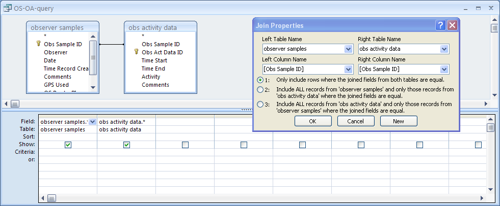
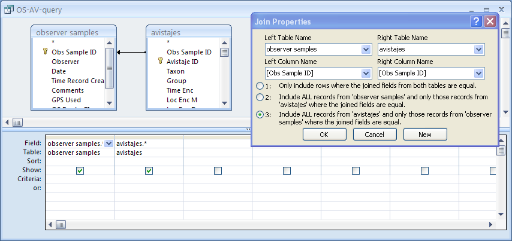

How to do the Monthly Report
================
Anthony Di Fiore
11/25/2017

Writing the Monthly Report
==========================

### Version 2017-10-07

INTRODUCTION
------------

Writing a monthly report is mandatory for everyone participating on one of the *Proyecto Primates* projects in Ecuador. The report should not exceed five pages in length, including quantitative tables but excluding any attached documents (photos, videos, etc.).

As of 2017-10, three separate reports should be done each month, one for the *Comparative Monogamy Project* (sent to Anthony Di Fiore, Max Snodderly, and Eduardo Fernandez-Duque) and one each for the woolly and spider monkey portions of the *Ateline Project* (sent to Anthony Di Fiore, Andres Link, Krista Milich, and Clara Scarry).

The report(s) must be sent before the 7th day of the month following the month that is being reported, and the associated databases should be uploaded by that date as well. We will acknowledge receiving it within a few days, and if you do not get the acknowledgement be sure to send the report again.

The narrative portions of the report should written in PLAIN TEXT using a text editor (e.g., Notepad++, TextWrangler) and then pasted into the appropriate sections of the report template. Tables and figures exported from `R` (see below) should also be copied and pasted into the appropriate sections of the report. The report should be saved with under the filename indicated below:

-   For the *Comparative Monogamy Project*: "MONTHLY REPORT YYYY-MM-DD - Comparative Monogamy Project"
-   For the woolly monkey portion of the *Ateline Project*: "MONTHLY REPORT YYYY-MM-DD - Lagothrix Project"
-   For the spider monkey portion of the *Ateline Project*: "MONTHLY REPORT YYYY-MM-DD - Ateles Project"

While the narrative parts of your report can be in Spanish, the filename MUST be written in English and follow the convention above EXACTLY.

> NOTE: Reports must be done based on information already entered, organized, and cleaned in the database!

Reports should be prepared JOINTLY by all of the individuals responsible for project activities during the month that is being reported, and the names of all those contributing to data collection and to preparation of the report should be included. Reports should be prepared following a team meeting that takes place during the very first few days of the month. We want to “force” each team to get together for lunch or dinner or something to stop and think, to exchange ideas about what went well and what did not go as well the previous month, and to plan collectively for the following month. Such a meeting helps the project *and* helps you become better scientists.

The report will have the following sections:

### 1. HEADER SECTION

The first few lines of the report shoud include the following information:

**Date Reported:** YYYY-MM-DD

Always use this convention for writing dates!

**Contributors:** List the full names of all people involved in collecting data this month and preparing the report.

Names should be separated by slashes ("/") with a slash at the end of the last name, just like they are entered in our iOS data collection devices

### 2. GENERAL SUMMARY SECTION

The summary should have the following components:

2.1 - A narrative section describing the main highlights of the team's activities and observations during the month, e.g., what areas the groups under study were using, comments on the general weather during the month, general observations about sexual activity, births, infant behavior, etc.

2.2 - Observer Activity - Summary tables reporting general information on the activities of *each person* on the project, including dates at the station and number of OSs. This should be generated using `R` code (see below).

2.3 - Avistajes Summary - A summary table reporting general information on the data collected by *each person and team*, including dates, number of AV collected, and total AV duration. This should be generated using `R` code (see below). Also include brief descriptions of notable observations made in the context of particular avistajes.

*Example:*

> AV08140 - 2017-09-12 - While doing routine demography work, I picked up a dead signal on Cuenca's collar (Faster beep rhythm). Found the collar on the ground with the ball chain broken at the base of the unit.

2.4 - Focal Sample Summary - A summary table reporting general information on the data collected on each focal animal, including dates, number of FSs collected, and total FS duration. This should be generated using `R` code (see below). Also include brief descriptions of notable observations made in the context of particular focal samples.

*Example:*

> NEED THIS.

### 3. DEMOGRAPHY SECTION

3.1 - A short narrative describing any significant demographic changes to any of your study groups which should include *each* of the following subsections. If a section is not relevant, indicate *NOT APPLICABLE*.

**Births:** (include the date the mother was LAST SEEN without an infant and the date she was FISRT SEEN within an infant)

**Deaths:** (include the date the body was recovered and describe what was done with the collected materials)

**Disappearances:** (include the date the individual was LAST SEEN)

**Immigrations:** (include the date the individual was FIRST SEEN and a description of the individual)

**Emigrations:** (include the date the individual was LAST SEEN in its old group, the date it was FIRST SEEN as a solitary animal, and the date is is FIRST SEEN in a new group, as well as the names of the relevant groups)

> **NOTE:** Be sure to always use `YYYY-MM-DD` format for dates! It is also helpful to include the ID numbers for relevant avistajes.

*Example:*

> **Emigrations:** Duana was last seen in the group on 2008-10-26 (AVxxxx). She was first seen traveling alone on 2008-10-30 (AVxxx)

3.2 - A summary table of the demography of *each* of the groups under study. This should be generated using `R` code.

### 4. COLLECTIONS AND MARKED TREES SECTION

4.1 - A summary table of the *biological samples* collected that month from the groups and individuals under study. This should be generated using `R` code.

4.2 - A summary table of the *new trees marked* this month. This should be generated using `R` code.

### 5. SPECIFIC DATA SECTIONS

Intergroup Encounters Dispersal Adult Replacement Vocalizations Sexual Behavior Anything else remarkable or unusual

CODE
----

The `R` code blocks below will help you generate the figures and tables needed for the monthly report

### Setting up observers, dates, taxa of interest, etc.

``` r
rm(list=c("observers","daterange","taxa")) # this line clears tables used for limiting observers, date ranges, and taxa from R; it will give a warning if these tables are not already present
```

    ## Warning in rm(list = c("observers", "daterange", "taxa")): object
    ## 'observers' not found

    ## Warning in rm(list = c("observers", "daterange", "taxa")): object
    ## 'daterange' not found

    ## Warning in rm(list = c("observers", "daterange", "taxa")): object 'taxa'
    ## not found

``` r
# MODIFY THE LINES BELOW FOR YOUR CIRCUMSTANCES!
observers <- c("Laura Gomez", "Cristian Alvarado") # a vector of observers
daterange <- c("2017-07-01", "2017-07-31") # a start and end date
taxa <- c("Ateles") # a vector of taxa to consider
groups <- c("Ateles MQ-1") # a vector of groups to consider

# UNCOMMENT the line below for a interactive selection of observer names from a list; NOT RECOMMENDED!
# observers <- as.character(obsEntryDialog(d))

# UNCOMMENT the line below for interactive selection of dates to consider; NOT RECOMMENDED!
# daterange <- as.Date(as.POSIXct(as.numeric(daterangeEntryDialog(d))*86400,origin="1970-01-01"))
```

### Generating Section 2.2 - Observer Activity

-   Open the *Proyecto Primates Main Database* and query the `observer samples` and `observer activity data` for data collected during the month in question. Set up the query as an "inner join" query (i.e., under join properites, select \[1\], i.e., "include rows where the joined fields from both tables are equal"...



Export the resulting query as "OS-OA-inner-join-query.xlsx" in `.xlsx` format. Move that file into the same folder as this document.

-   Open `R` and run the following:

``` r
# The following code parses the results of a regular query (inner join) of `observer samples` and `observer activity data`; here, we start with a query of two tables in Access...

d <- read_xlsx("OS-OA-inner-join-query.xlsx", guess_max = 10000) # guess max set close to length of file
d <- rename(d, `Obs Sample ID` = `observer samples_Obs Sample ID`)
d <- select(d, -`obs activity data_Obs Sample ID`)

# Alternatively, we can read in two complete tables of observer samples and observer activity dumped from Access and do the inner join on them directly in R...

os <- read_xlsx("observer samples.xlsx", guess_max = 10000) # guess max set close to length of file
oa <- read_xlsx("obs activity data.xlsx", guess_max = 30000) # guess max set close to length of file
d <- inner_join(os, oa, by = "Obs Sample ID")

# Note: the line above will give us the same result as doing an inner join query in Access BUT we don't wind up with two variables for Obs Sample ID so the `rename` step above isn't necessary, nor is the `select` step to drop the second Obs Sample ID variable.

# Note: We could also use a "right_join" to return all rows of obs activity data plus matching rows of observer samples; these *should* be equivalent as obs activity data should always have an observer sample parent!

d <- rowid_to_column(d, "rowID")
vars <- c("rowID", "Obs Sample ID", "Observer", "Date", "GPS Used", "Time Start", "Time End", "Activity")
d <- select(d, vars)
d <- arrange(d, `Observer`, `Date`, `Obs Sample ID`, `Time Start`)

if (length(observers) > 0) {d <- filter(d, `Observer` %in% observers)}
if (length(daterange) > 0) {d <- filter(d, Date >= daterange[1] & Date <= daterange[2])}

d <- fixdate(d, datefield="Date")
d <- fixtime(d, datefield="Date", timefield=c("Time Start", "Time End"), offsetFromGMT, timezone)

d <- mutate(d, Duration=`Time End`-`Time Start`)
units(d$Duration) <- "secs"
d <- mutate(d, `General Activity` =
                            ifelse(grepl("Field work", `Activity`), "Field Work",
                            ifelse(grepl("Camp - personal", `Activity`), "Camp - Personal",
                            ifelse(grepl("Camp - project work", `Activity`), "Camp - Project",
                            ifelse(grepl("Travel", `Activity`), "Travel",
                            "Other")))))

# now find records where the duration of an observer activity is <= 0 seconds... these should be checked and corrected in database
warnings <- d %>% filter(Duration <= 0 | is.na(Duration))

if (!is.null(warnings)) {
    print("WARNING: Check the following rows of observer activity data as the start and end times entered imply that the activity lasted 0 seconds or less! or that either Time Start or End = NA!")
    print(warnings)
    }
```

    ## [1] "WARNING: Check the following rows of observer activity data as the start and end times entered imply that the activity lasted 0 seconds or less! or that either Time Start or End = NA!"
    ## # A tibble: 2 x 10
    ##   rowID `Obs Sample ID`          Observer       Date `GPS Used`
    ##   <int>           <chr>             <chr>     <date>      <chr>
    ## 1   829         OS36045 Cristian Alvarado 2017-07-31   GPS PP12
    ## 2   687         OS35541       Laura Gomez 2017-07-27       None
    ## # ... with 5 more variables: `Time Start` <dttm>, `Time End` <dttm>,
    ## #   Activity <chr>, Duration <time>, `General Activity` <chr>

``` r
d <- d %>% filter(Duration > 0 ) # this keeps only lines with duration > 0

output <- d %>% group_by(`Observer`, `Date`, `Obs Sample ID`, `General Activity`) %>% summarize(`Duration` = sum(`Duration`, na.rm = T)) %>% spread(`General Activity`, `Duration`, fill = 0, convert = FALSE) %>% mutate(`Total`=`Camp - Personal` + `Camp - Project` + `Field Work`) %>% ungroup() %>% select(`Observer`, `Date`, `Obs Sample ID`, `Field Work`, `Camp - Project`, `Camp - Personal`, `Total`)

output <- mutate(output, "F" = ifelse(`Field Work` >= 3600 * 8, 1, 0)) # more than 8 hours field work
output <- mutate(output, "D" = ifelse(`Camp - Project` >= 3600 * 8, 1, 0)) # more than 8 hours project work
output <- mutate(output, "F+D" = ifelse(`Field Work` >= 3600 * 4 & `Camp - Project` >= 3600 * 4, 1, 0)) # more than 4 hours each of field and project work
output <- mutate(output, "P+D" = ifelse(`Camp - Project` >= 3600 * 4 & `Camp - Personal` >= 3600 * 4, 1, 0)) # more than 4 hours each of project work and personal time
output <- mutate(output, "F+P" = ifelse(`Field Work` >= 3600 * 4 & `Camp - Personal` >= 3600 * 4, 1, 0)) # more than 4 hours each of field work and personal time
output <- mutate(output, "P" = ifelse(`Camp - Personal` >= 3600 * 8, 1, 0)) # more than 8 hours of personal time
output <- mutate(output, "OS" = 1)
units(output$`Field Work`) <- "hours"
units(output$`Camp - Personal`) <- "hours"
units(output$`Camp - Project`) <- "hours"
units(output$`Total`) <- "hours"

output_md <- kable(output[,c(1:7)], digits = 1, caption="Observer Activity by Day") # this makes a nice output in markdown
output_md
```

| Observer          | Date       | Obs Sample ID | Field Work | Camp - Project | Camp - Personal | Total      |
|:------------------|:-----------|:--------------|:-----------|:---------------|:----------------|:-----------|
| Cristian Alvarado | 2017-07-14 | OS36028       | 0.0 hours  | 0.0 hours      | 12.0 hours      | 12.0 hours |
| Cristian Alvarado | 2017-07-15 | OS36029       | 11.2 hours | 0.0 hours      | 0.0 hours       | 11.2 hours |
| Cristian Alvarado | 2017-07-16 | OS36030       | 9.2 hours  | 0.0 hours      | 0.0 hours       | 9.2 hours  |
| Cristian Alvarado | 2017-07-17 | OS36031       | 10.7 hours | 0.0 hours      | 0.0 hours       | 10.7 hours |
| Cristian Alvarado | 2017-07-18 | OS36032       | 10.4 hours | 0.0 hours      | 0.0 hours       | 10.4 hours |
| Cristian Alvarado | 2017-07-19 | OS36033       | 0.0 hours  | 1.0 hours      | 12.0 hours      | 13.0 hours |
| Cristian Alvarado | 2017-07-20 | OS36034       | 4.8 hours  | 0.0 hours      | 0.0 hours       | 4.8 hours  |
| Cristian Alvarado | 2017-07-21 | OS36035       | 0.0 hours  | 9.5 hours      | 0.5 hours       | 10.0 hours |
| Cristian Alvarado | 2017-07-22 | OS36036       | 7.5 hours  | 0.0 hours      | 0.0 hours       | 7.5 hours  |
| Cristian Alvarado | 2017-07-23 | OS36037       | 12.8 hours | 0.0 hours      | 0.0 hours       | 12.8 hours |
| Cristian Alvarado | 2017-07-24 | OS36038       | 13.1 hours | 0.0 hours      | 0.0 hours       | 13.1 hours |
| Cristian Alvarado | 2017-07-25 | OS36039       | 9.8 hours  | 0.0 hours      | 0.0 hours       | 9.8 hours  |
| Cristian Alvarado | 2017-07-26 | OS36040       | 12.0 hours | 0.0 hours      | 0.0 hours       | 12.0 hours |
| Cristian Alvarado | 2017-07-27 | OS36041       | 0.0 hours  | 11.5 hours     | 0.0 hours       | 11.5 hours |
| Cristian Alvarado | 2017-07-28 | OS36042       | 0.0 hours  | 11.5 hours     | 0.0 hours       | 11.5 hours |
| Cristian Alvarado | 2017-07-29 | OS36043       | 0.0 hours  | 11.5 hours     | 0.0 hours       | 11.5 hours |
| Cristian Alvarado | 2017-07-30 | OS36044       | 12.6 hours | 0.0 hours      | 0.0 hours       | 12.6 hours |
| Cristian Alvarado | 2017-07-31 | OS36045       | 13.4 hours | 0.0 hours      | 0.0 hours       | 13.4 hours |
| Laura Gomez       | 2017-07-07 | OS35521       | 10.0 hours | 0.0 hours      | 0.0 hours       | 10.0 hours |
| Laura Gomez       | 2017-07-08 | OS35522       | 12.4 hours | 0.0 hours      | 0.0 hours       | 12.4 hours |
| Laura Gomez       | 2017-07-09 | OS35523       | 0.0 hours  | 0.0 hours      | 11.0 hours      | 11.0 hours |
| Laura Gomez       | 2017-07-10 | OS35524       | 10.9 hours | 0.0 hours      | 0.0 hours       | 10.9 hours |
| Laura Gomez       | 2017-07-11 | OS35525       | 12.1 hours | 0.0 hours      | 0.0 hours       | 12.1 hours |
| Laura Gomez       | 2017-07-12 | OS35526       | 12.5 hours | 0.0 hours      | 0.0 hours       | 12.5 hours |
| Laura Gomez       | 2017-07-13 | OS35527       | 0.0 hours  | 11.5 hours     | 0.0 hours       | 11.5 hours |
| Laura Gomez       | 2017-07-14 | OS35528       | 0.0 hours  | 9.5 hours      | 2.0 hours       | 11.5 hours |
| Laura Gomez       | 2017-07-15 | OS35529       | 11.1 hours | 0.0 hours      | 0.0 hours       | 11.1 hours |
| Laura Gomez       | 2017-07-16 | OS35530       | 9.3 hours  | 0.0 hours      | 0.0 hours       | 9.3 hours  |
| Laura Gomez       | 2017-07-17 | OS35531       | 10.9 hours | 0.0 hours      | 0.0 hours       | 10.9 hours |
| Laura Gomez       | 2017-07-18 | OS35532       | 8.8 hours  | 2.7 hours      | 0.0 hours       | 11.5 hours |
| Laura Gomez       | 2017-07-19 | OS35533       | 0.0 hours  | 2.0 hours      | 11.0 hours      | 13.0 hours |
| Laura Gomez       | 2017-07-20 | OS35534       | 4.6 hours  | 5.4 hours      | 0.0 hours       | 10.0 hours |
| Laura Gomez       | 2017-07-21 | OS35535       | 0.0 hours  | 8.0 hours      | 2.5 hours       | 10.5 hours |
| Laura Gomez       | 2017-07-22 | OS35536       | 12.7 hours | 0.0 hours      | 0.0 hours       | 12.7 hours |
| Laura Gomez       | 2017-07-23 | OS35537       | 11.7 hours | 0.0 hours      | 0.0 hours       | 11.7 hours |
| Laura Gomez       | 2017-07-24 | OS35538       | 12.5 hours | 0.0 hours      | 0.0 hours       | 12.5 hours |
| Laura Gomez       | 2017-07-25 | OS35539       | 11.2 hours | 0.0 hours      | 0.0 hours       | 11.2 hours |
| Laura Gomez       | 2017-07-26 | OS35540       | 12.3 hours | 0.0 hours      | 0.0 hours       | 12.3 hours |
| Laura Gomez       | 2017-07-27 | OS35541       | 0.0 hours  | 0.0 hours      | 2.0 hours       | 2.0 hours  |
| Laura Gomez       | 2017-07-28 | OS35542       | 0.0 hours  | 9.2 hours      | 2.2 hours       | 11.5 hours |
| Laura Gomez       | 2017-07-29 | OS35543       | 0.0 hours  | 10.0 hours     | 1.6 hours       | 11.6 hours |
| Laura Gomez       | 2017-07-30 | OS35544       | 12.9 hours | 0.0 hours      | 0.0 hours       | 12.9 hours |
| Laura Gomez       | 2017-07-31 | OS35545       | 13.0 hours | 0.0 hours      | 0.0 hours       | 13.0 hours |

``` r
output_summary <- group_by(output, `Observer`) %>%
    summarize(`minDate`=min(`Date`),`maxDate`=max(`Date`), `minOS`=min(`Obs Sample ID`), `maxOS`=max(`Obs Sample ID`), `OS Count`= n(), `Field Work` = sum(`Field Work`), `Camp - Project` = sum(`Camp - Project`), `Camp - Personal` = sum(`Camp - Personal`), `F`=sum(`F`), `D`=sum(`D`), `F+D`=sum(`F+D`), `P+D`= sum(`P+D`),`F+P`= sum(`F+P`), `P`=sum(`P`), `Total`=sum(`Total`)) %>%
    mutate(`Date Range` = paste0(minDate," to ", maxDate)) %>%
    mutate(`OS Range` = paste0(minOS, " to ", maxOS)) %>%
    select(`Observer`,`Date Range`, `OS Range`,`OS Count`,`Field Work`,`Camp - Project`,`Camp - Personal`,`Total`)

output_summary_md <- kable(output_summary, digits = 1, caption="Observer Activity Summary")
output_summary_md
```

| Observer          | Date Range               | OS Range           |  OS Count| Field Work  | Camp - Project | Camp - Personal | Total       |
|:------------------|:-------------------------|:-------------------|---------:|:------------|:---------------|:----------------|:------------|
| Cristian Alvarado | 2017-07-14 to 2017-07-31 | OS36028 to OS36045 |        18| 127.7 hours | 45.0 hours     | 24.5 hours      | 197.2 hours |
| Laura Gomez       | 2017-07-07 to 2017-07-31 | OS35521 to OS35545 |        25| 188.9 hours | 58.3 hours     | 32.3 hours      | 279.6 hours |

``` r
out <- regulartable(output)
out <- set_formatter( x = out, `Field Work` = function(x) sprintf("%.01f", x)) %>%
    set_formatter( `Camp - Project` = function(x) sprintf("%.01f", x)) %>%
    set_formatter(  `Camp - Personal` = function(x) sprintf("%.01f", x)) %>%
    set_formatter(  `Total` = function(x) sprintf("%.01f", x)) %>%
    theme_zebra() %>% 
  autofit()

outsummary <- regulartable(output_summary)
outsummary <- set_formatter( x = outsummary, `Field Work` = function(x) sprintf("%.01f", x)) %>%
    set_formatter( `Camp - Project` = function(x) sprintf("%.01f", x)) %>%
    set_formatter(  `Camp - Personal` = function(x) sprintf("%.01f", x)) %>%
    set_formatter(  `Total` = function(x) sprintf("%.01f", x)) %>%
    theme_zebra() %>% 
    autofit()

my_doc <- my_doc %>%
    body_add_par("Observer Activity by Day", style="heading 2", pos="after") %>%
    body_add_par("") %>%
    body_add_flextable(value=out) %>%
    body_add_par("") %>%
    body_add_par("Observer Activity Summary", style="heading 2") %>%
    body_add_par("") %>%
    body_add_flextable(value=outsummary)
```

### Generating Section 2.3 - Avistajes Summary

-   Open the *Proyecto Primates Main Database* and query the `observer samples` and `avistajes` tables for data collected during the month in question. Set up the query as a "right join" query (i.e., under join properites, select \[3\], i.e., "include ALL records from `avistajes` and only those records from `observer samples` where the joined fields are equal"...



Export the resulting query as "OS-AV-query-right-join.xlsx" in `.xlsx` format. Move that file into the same folder as this document.

> NOTE: be sure to do what is known as a RIGHT JOIN, where we select rows from the nested table and match those up with a parent... this way OSs with no AVs do not get selected (and we drop any AVs that do not have a parent OS).

-   Open `R` and run the following:

``` r
# The following code parses the results of the right join of `observer samples` and `avistajes`; here, we start with a query of two tables in Access...

d <- read_xlsx("OS-AV-right-join-query.xlsx", guess_max = 10000) # guess max set close to length of file
d <- rename(d, `Obs Sample ID` = `observer samples_Obs Sample ID`)
d <- select(d, -`avistajes_Obs Sample ID`)

# Alternatively, we can read in two complete tables of observer samples and avistajes dumped from Access and do the right join on them directly in R...

os <- read_xlsx("observer samples.xlsx", guess_max = 10000) # guess max set close to length of file
av <- read_xlsx("avistajes.xlsx", guess_max = 30000) # guess max set close to length of file
d <- right_join(os, av, by = "Obs Sample ID")

# Note: The line above will give us the same result as doing the right join query in Access BUT we don't wind up with two variables for Obs Sample ID so the `rename` step above isn't necessary, nor is the `select` step to drop the second Obs Sample ID variable.

# Note: We could also use inner_join to return only rows of avistaje data that have matching rows of observer samples; these *should* be equivalent as avistaje data should always have an observer sample parent.

d <- rowid_to_column(d, "rowID")
vars <- c("rowID", "Obs Sample ID", "Observer", "Date", "GPS Used", "Avistaje ID", "Taxon", "Group", "Time Enc", "Time Left/Lost", "Other Observer Present", "Found in Sleep Tree", "Left in Sleep Tree")
d <- select(d,vars)
d <- arrange(d,`Observer`, `Date`, `Time Enc`)

if (length(observers) > 0) {d <- filter(d, `Observer` %in% observers)}
if (length(daterange) > 0) {d <- filter(d, Date >= daterange[1] & Date <= daterange[2])}
if (length(taxa) > 0) {d <- filter(d, `Taxon` %in% taxa)}

d <- fixdate(d, datefield="Date") # makes sure that the date is in the correct format
d <- fixtime(d, datefield="Date", timefield=c("Time Enc", "Time Left/Lost"), offsetFromGMT, timezone) # makes sure times are in correct format
d <- mutate(d, Duration=`Time Left/Lost`-`Time Enc`) # calculates avistaje duration
units(d$Duration) <- "secs"

# find records where the duration of an avistaje is <= 0 seconds... these should be checked and corrected in database
warnings <- d %>% filter(Duration <= 0 | is.na(Duration))

if (!is.null(warnings)) {
    print("WARNING: Check the following avistajes as the times imply that the avistaje lasted < 0 seconds or that either Time Enc or Time Left/Lost = NA!")
    print(warnings)
    }
```

    ## [1] "WARNING: Check the following avistajes as the times imply that the avistaje lasted < 0 seconds or that either Time Enc or Time Left/Lost = NA!"
    ## # A tibble: 27 x 14
    ##    rowID `Obs Sample ID`          Observer       Date `GPS Used`
    ##    <int>           <chr>             <chr>     <date>      <chr>
    ##  1   578         OS36017 Cristian Alvarado 2017-07-03   GPS PP12
    ##  2   583         OS36019 Cristian Alvarado 2017-07-05   GPS Used
    ##  3   588         OS36022 Cristian Alvarado 2017-07-08   GPS PP12
    ##  4   593         OS36025 Cristian Alvarado 2017-07-11   GPS PP12
    ##  5   612         OS36036 Cristian Alvarado 2017-07-22   GPS PP12
    ##  6   615         OS36037 Cristian Alvarado 2017-07-23   GPS PP12
    ##  7   617         OS36038 Cristian Alvarado 2017-07-24   GPS PP12
    ##  8   622         OS36039 Cristian Alvarado 2017-07-25   GPS PP12
    ##  9   632         OS36040 Cristian Alvarado 2017-07-26   GPS PP12
    ## 10   626         OS36040 Cristian Alvarado 2017-07-26   GPS PP12
    ## # ... with 17 more rows, and 9 more variables: `Avistaje ID` <chr>,
    ## #   Taxon <chr>, Group <chr>, `Time Enc` <dttm>, `Time Left/Lost` <dttm>,
    ## #   `Other Observer Present` <chr>, `Found in Sleep Tree` <lgl>, `Left in
    ## #   Sleep Tree` <lgl>, Duration <time>

``` r
d <- filter(d, `Duration` > 0) # for summarizing avistajes, pick only those where AV duration is >0

output <- d %>% mutate(`Start`=format(`Time Enc`, format="%H:%M:%S"),`End`=format(`Time Left/Lost`, format="%H:%M:%S")) %>% select(`Observer`, `Date`, `Avistaje ID`, `Taxon`, `Group`, `Start`, `End`, `Duration`)
units(output$`Duration`) <- "hours"

output_md <- kable(output, digits=3, caption="Avistajes by Observer and Date")
output_md
```

| Observer          | Date       | Avistaje ID | Taxon  | Group       | Start    | End      | Duration     |
|:------------------|:-----------|:------------|:-------|:------------|:---------|:---------|:-------------|
| Cristian Alvarado | 2017-07-04 | AV40028     | Ateles | Ateles MQ-1 | 05:37:53 | 10:05:00 | 4.452 hours  |
| Cristian Alvarado | 2017-07-04 | AV40029     | Ateles | Ateles MQ-1 | 13:30:05 | 17:40:00 | 4.165 hours  |
| Cristian Alvarado | 2017-07-07 | AV40033     | Ateles | Ateles MQ-1 | 12:10:00 | 17:31:54 | 5.365 hours  |
| Cristian Alvarado | 2017-07-10 | AV40039     | Ateles | Ateles MQ-1 | 08:30:00 | 17:41:30 | 9.192 hours  |
| Cristian Alvarado | 2017-07-12 | AV40042     | Ateles | Ateles MQ-1 | 06:16:00 | 17:01:49 | 10.764 hours |
| Cristian Alvarado | 2017-07-16 | AV40048     | Ateles | Ateles MQ-1 | 06:45:00 | 14:45:12 | 8.003 hours  |
| Cristian Alvarado | 2017-07-17 | AV40051     | Ateles | Ateles MQ-1 | 10:44:49 | 17:01:27 | 6.277 hours  |
| Cristian Alvarado | 2017-07-18 | AV40054     | Ateles | Ateles MQ-1 | 13:04:13 | 15:00:00 | 1.930 hours  |
| Cristian Alvarado | 2017-07-23 | AV40064     | Ateles | Ateles MQ-1 | 07:38:50 | 18:30:00 | 10.853 hours |
| Cristian Alvarado | 2017-07-24 | AV40066     | Ateles | Ateles MQ-1 | 11:10:00 | 18:00:00 | 6.833 hours  |
| Cristian Alvarado | 2017-07-25 | AV40071     | Ateles | Ateles MQ-1 | 10:10:00 | 11:35:00 | 1.417 hours  |
| Cristian Alvarado | 2017-07-25 | AV40072     | Ateles | Ateles MQ-1 | 14:30:00 | 15:40:00 | 1.167 hours  |
| Cristian Alvarado | 2017-07-26 | AV40077     | Ateles | Ateles MQ-1 | 08:40:00 | 10:50:00 | 2.167 hours  |
| Cristian Alvarado | 2017-07-26 | AV40078     | Ateles | Ateles MQ-1 | 15:03:00 | 16:20:00 | 1.283 hours  |
| Cristian Alvarado | 2017-07-30 | AV40081     | Ateles | Ateles MQ-1 | 06:55:59 | 07:40:00 | 0.734 hours  |
| Cristian Alvarado | 2017-07-31 | AV40085     | Ateles | Ateles MQ-1 | 05:48:32 | 18:31:59 | 12.724 hours |
| Laura Gomez       | 2017-07-03 | AV39528     | Ateles | Ateles MQ-1 | 09:20:23 | 17:47:48 | 8.457 hours  |
| Laura Gomez       | 2017-07-05 | AV39533     | Ateles | Ateles MQ-1 | 09:40:02 | 17:30:34 | 7.842 hours  |
| Laura Gomez       | 2017-07-08 | AV39537     | Ateles | Ateles MQ-1 | 06:51:29 | 18:00:00 | 11.142 hours |
| Laura Gomez       | 2017-07-11 | AV39542     | Ateles | Ateles MQ-1 | 07:54:57 | 17:30:00 | 9.584 hours  |
| Laura Gomez       | 2017-07-17 | AV39551     | Ateles | Ateles MQ-1 | 13:56:00 | 16:45:00 | 2.817 hours  |
| Laura Gomez       | 2017-07-18 | AV39552     | Ateles | Ateles MQ-1 | 09:27:00 | 12:00:00 | 2.550 hours  |
| Laura Gomez       | 2017-07-22 | AV39558     | Ateles | Ateles MQ-1 | 10:00:00 | 18:00:00 | 8.000 hours  |
| Laura Gomez       | 2017-07-23 | AV39561     | Ateles | Ateles MQ-1 | 07:38:00 | 17:20:00 | 9.700 hours  |
| Laura Gomez       | 2017-07-24 | AV39562     | Ateles | Ateles MQ-1 | 05:40:00 | 06:20:00 | 0.667 hours  |
| Laura Gomez       | 2017-07-24 | AV39563     | Ateles | Ateles MQ-1 | 11:13:19 | 11:48:00 | 0.578 hours  |
| Laura Gomez       | 2017-07-25 | AV39568     | Ateles | Ateles MQ-1 | 10:10:00 | 11:30:00 | 1.333 hours  |
| Laura Gomez       | 2017-07-25 | AV39569     | Ateles | Ateles MQ-1 | 12:10:00 | 18:00:00 | 5.833 hours  |
| Laura Gomez       | 2017-07-26 | AV39570     | Ateles | Ateles MQ-1 | 05:41:52 | 06:30:00 | 0.802 hours  |
| Laura Gomez       | 2017-07-26 | AV39574     | Ateles | Ateles MQ-1 | 08:20:00 | 11:12:00 | 2.867 hours  |
| Laura Gomez       | 2017-07-30 | AV39577     | Ateles | Ateles MQ-1 | 06:33:56 | 07:29:00 | 0.918 hours  |
| Laura Gomez       | 2017-07-30 | AV39579     | Ateles | Ateles MQ-1 | 10:02:40 | 18:30:00 | 8.456 hours  |

``` r
output_summary <- group_by(output,`Observer`,`Taxon`, `Group`) %>% 
    summarize(`minDate`=min(`Date`),`maxDate`=max(`Date`), `minAV`=min(`Avistaje ID`), `maxAV`=max(`Avistaje ID`), `AV Count`= n(), `Total Duration`=sum(`Duration`, na.rm = T)) %>%
    mutate(`Date Range` = paste0(minDate," to ", maxDate)) %>%
    mutate(`AV Range` = paste0(minAV, " to ", maxAV)) %>%
    select(`Observer`,`Date Range`, `Taxon`,`Group`, `AV Range`, `AV Count`, `Total Duration`)

units(output_summary$`Total Duration`) <- "hours"

output_summary_md <- kable(output_summary, digits=3, caption="Avistaje Summary by Observer and Group")
output_summary_md
```

| Observer          | Date Range               | Taxon  | Group       | AV Range           |  AV Count| Total Duration |
|:------------------|:-------------------------|:-------|:------------|:-------------------|---------:|:---------------|
| Cristian Alvarado | 2017-07-04 to 2017-07-31 | Ateles | Ateles MQ-1 | AV40028 to AV40085 |        16| 87.325 hours   |
| Laura Gomez       | 2017-07-03 to 2017-07-30 | Ateles | Ateles MQ-1 | AV39528 to AV39579 |        16| 81.546 hours   |

``` r
out <- regulartable(output)
out <- set_formatter(x = out, Duration = function(x) sprintf("%.03f", x)) %>%
    theme_zebra() %>% 
  autofit()

outsummary <- regulartable(output_summary)
outsummary <- set_formatter( x = outsummary, `Total Duration` = function(x) sprintf("%.03f", x)) %>%
    theme_zebra() %>% 
  autofit()

my_doc <- my_doc %>%
    body_add_par("Avistajes by Observer and Date", style="heading 2") %>%
    body_add_par("") %>%
    body_add_flextable(value=out) %>%
    body_add_par("") %>%
    body_add_par("Avistaje Summary by Observer and Group", style="heading 2") %>%
    body_add_par("") %>%
    body_add_flextable(value=outsummary)
```

### Generating Section 2.4 - Focal Sample Summary

-   Open the *Proyecto Primates Main Database* and query the `observer samples`, `avistajes`, and `focal samples` tables for data collected during the month in question. Set up the query as a double "right join" query (i.e., under join properites for both links, select \[3\], i.e., "include ALL records from the left hand table and only those records from the right hand table where the joined fields are equal"...


``` r
# The following code parses the results of the right join of `observer samples`, `avistajes`, and `focal samples`; here, we start with a query of the three tables in Access...

d <- read_xlsx("OS-AV-FS-right-join-query.xlsx", guess_max = 10000) # guess max set close to length of file
d <- rename(d, `Obs Sample ID` = `observer samples_Obs Sample ID`)
d <- select(d, -`avistajes_Obs Sample ID`)
d <- rename(d, `Avistaje ID` = `avistajes_Avistaje ID`)
d <- select(d, -`focal samples_Avistaje ID`)


# Alternatively, we can read in three complete tables of observer samples, avistajes, and focal samples dumped from Access and do the right join on them directly in R...

os <- read_xlsx("observer samples.xlsx", guess_max = 10000) # guess max set close to length of file
av <- read_xlsx("avistajes.xlsx", guess_max = 30000) # guess max set close to length of file
d <- right_join(os, av, by = "Obs Sample ID")
fs <- read_xlsx("focal samples.xlsx", guess_max = 30000) # guess max set close to length of file
d <- right_join(d, fs, by = "Avistaje ID")

d <- rowid_to_column(d, "rowID")

vars <- c("rowID", "Obs Sample ID", "Observer", "Date", "GPS Used", "Avistaje ID", "Taxon", "Group", "Time Enc", "Time Left/Lost", "Avistaje Notes", "Other Observer Present", "Found in Sleep Tree", "Left in Sleep Tree", "Follow Data Included", "Focal Sample ID", "Focal Animal", "Time Start", "Time End","Focal Completion")
d <- select(d,vars)
d <- arrange(d,`Observer`, `Date`, `Time Enc`, `Time Start`)

if (length(observers) > 0) {d <- filter(d, `Observer` %in% observers)}
if (length(daterange) > 0) {d <- filter(d, Date >= daterange[1] & Date <= daterange[2])}
if (length(taxa) > 0) {d <- filter(d, `Taxon` %in% taxa)}

d <- fixdate(d, datefield="Date") # makes sure that the date is in the correct format
d <- fixtime(d, datefield="Date", timefield=c("Time Enc", "Time Left/Lost", "Time Start", "Time End"), offsetFromGMT, timezone) # makes sure times are in correct format
d <- mutate(d, `Avistaje Duration`=`Time Left/Lost`-`Time Enc`) # calculates avistaje duration
units(d$`Avistaje Duration`) <- "secs"
d <- mutate(d, `Focal Duration` = `Time End` - `Time Start`)
units(d$`Focal Duration`) <- "secs"

# find records where the duration of an focal samples is <= 0 seconds... these should be checked and corrected in database
warnings <- d %>% filter(`Focal Duration` <= 0 | is.na(`Focal Duration`))

if (!is.null(warnings)) {
    print("WARNING: Check the following focal samples as the times imply that the sample lasted < 0 seconds or that either Time Start or Time End = NA!")
    print(warnings)
    }
```

    ## [1] "WARNING: Check the following focal samples as the times imply that the sample lasted < 0 seconds or that either Time Start or Time End = NA!"
    ## # A tibble: 0 x 22
    ## # ... with 22 variables: rowID <int>, Obs Sample ID <chr>, Observer <chr>,
    ## #   Date <date>, GPS Used <chr>, Avistaje ID <chr>, Taxon <chr>,
    ## #   Group <chr>, Time Enc <dttm>, Time Left/Lost <dttm>, Avistaje
    ## #   Notes <chr>, Other Observer Present <chr>, Found in Sleep Tree <lgl>,
    ## #   Left in Sleep Tree <lgl>, Follow Data Included <lgl>, Focal Sample
    ## #   ID <chr>, Focal Animal <chr>, Time Start <dttm>, Time End <dttm>,
    ## #   Focal Completion <chr>, Avistaje Duration <time>, Focal
    ## #   Duration <time>

``` r
d <- filter(d, `Focal Duration` > 0) # for summarizing focal samples, pick only those where FS duration is >0

output <- d %>% mutate(`Start`=format(`Time Start`, format="%H:%M:%S"),`End`=format(`Time End`, format="%H:%M:%S")) %>% select(`Observer`, `Date`, `Avistaje ID`, `Taxon`, `Group`, `Focal Sample ID`, `Focal Animal`, `Start`, `End`, `Focal Duration`)
units(output$`Focal Duration`) <- "hours"

output_md <- kable(output, digits=3, caption="Focal Samples by Observer, Date, and Subject")
output_md
```

| Observer          | Date       | Avistaje ID | Taxon  | Group       | Focal Sample ID | Focal Animal | Start    | End      | Focal Duration |
|:------------------|:-----------|:------------|:-------|:------------|:----------------|:-------------|:---------|:---------|:---------------|
| Cristian Alvarado | 2017-07-04 | AV40028     | Ateles | Ateles MQ-1 | FS33004         | Nenki/       | 05:39:46 | 10:05:00 | 4.421 hours    |
| Cristian Alvarado | 2017-07-07 | AV40033     | Ateles | Ateles MQ-1 | FS33005         | Sofia/       | 12:10:42 | 17:31:00 | 5.338 hours    |
| Cristian Alvarado | 2017-07-10 | AV40039     | Ateles | Ateles MQ-1 | FS33006         | Nipa/        | 08:30:06 | 17:40:00 | 9.165 hours    |
| Cristian Alvarado | 2017-07-12 | AV40042     | Ateles | Ateles MQ-1 | FS33007         | Buka/        | 06:21:09 | 17:01:19 | 10.669 hours   |
| Cristian Alvarado | 2017-07-16 | AV40048     | Ateles | Ateles MQ-1 | FS33008         | Ayax/        | 06:45:00 | 14:45:00 | 8.000 hours    |
| Cristian Alvarado | 2017-07-17 | AV40051     | Ateles | Ateles MQ-1 | FS33009         | Sofia/       | 10:45:06 | 17:02:21 | 6.287 hours    |
| Cristian Alvarado | 2017-07-18 | AV40054     | Ateles | Ateles MQ-1 | FS33010         | Sofia/       | 12:55:00 | 15:00:00 | 2.083 hours    |
| Cristian Alvarado | 2017-07-23 | AV40064     | Ateles | Ateles MQ-1 | FS33011         | Ayax/        | 07:40:06 | 08:30:00 | 0.832 hours    |
| Cristian Alvarado | 2017-07-23 | AV40064     | Ateles | Ateles MQ-1 | FS33012         | Olio/        | 08:45:00 | 18:30:00 | 9.750 hours    |
| Cristian Alvarado | 2017-07-24 | AV40066     | Ateles | Ateles MQ-1 | FS33013         | Rumba/       | 11:40:00 | 13:50:00 | 2.167 hours    |
| Cristian Alvarado | 2017-07-24 | AV40066     | Ateles | Ateles MQ-1 | FS33014         | Ana/         | 14:00:00 | 18:00:00 | 4.000 hours    |
| Cristian Alvarado | 2017-07-25 | AV40071     | Ateles | Ateles MQ-1 | FS33015         | Olio/        | 10:15:00 | 11:35:00 | 1.333 hours    |
| Cristian Alvarado | 2017-07-25 | AV40072     | Ateles | Ateles MQ-1 | FS33016         | Olio/        | 14:30:00 | 15:40:00 | 1.167 hours    |
| Cristian Alvarado | 2017-07-26 | AV40077     | Ateles | Ateles MQ-1 | FS33017         | Sammy/       | 08:40:00 | 10:50:00 | 2.167 hours    |
| Cristian Alvarado | 2017-07-26 | AV40078     | Ateles | Ateles MQ-1 | FS33018         | Rumba/       | 15:03:00 | 16:20:00 | 1.283 hours    |
| Cristian Alvarado | 2017-07-30 | AV40081     | Ateles | Ateles MQ-1 | FS33019         | Andreo/      | 06:55:00 | 07:40:00 | 0.750 hours    |
| Cristian Alvarado | 2017-07-31 | AV40085     | Ateles | Ateles MQ-1 | FS33020         | Ayax/        | 05:50:03 | 12:15:00 | 6.416 hours    |
| Cristian Alvarado | 2017-07-31 | AV40085     | Ateles | Ateles MQ-1 | FS33021         | Olio/        | 12:15:00 | 18:31:28 | 6.274 hours    |
| Laura Gomez       | 2017-07-05 | AV39533     | Ateles | Ateles MQ-1 | FS32502         | Buka/        | 09:40:27 | 13:25:00 | 3.743 hours    |
| Laura Gomez       | 2017-07-05 | AV39533     | Ateles | Ateles MQ-1 | FS32503         | Buka/        | 16:15:00 | 17:30:00 | 1.250 hours    |
| Laura Gomez       | 2017-07-08 | AV39537     | Ateles | Ateles MQ-1 | FS32504         | Ayax/        | 06:55:00 | 18:00:00 | 11.083 hours   |
| Laura Gomez       | 2017-07-11 | AV39542     | Ateles | Ateles MQ-1 | FS32505         | Sofia/       | 07:59:55 | 09:10:00 | 1.168 hours    |
| Laura Gomez       | 2017-07-11 | AV39542     | Ateles | Ateles MQ-1 | FS32506         | Summer/      | 09:10:00 | 11:50:00 | 2.667 hours    |
| Laura Gomez       | 2017-07-11 | AV39542     | Ateles | Ateles MQ-1 | FS32507         | Taiga/       | 11:55:00 | 12:15:00 | 0.333 hours    |
| Laura Gomez       | 2017-07-11 | AV39542     | Ateles | Ateles MQ-1 | FS32508         | Buka/        | 15:00:00 | 17:30:00 | 2.500 hours    |
| Laura Gomez       | 2017-07-17 | AV39551     | Ateles | Ateles MQ-1 | FS32509         | Nipa/        | 13:56:00 | 16:45:00 | 2.817 hours    |
| Laura Gomez       | 2017-07-18 | AV39552     | Ateles | Ateles MQ-1 | FS32510         | Ana/         | 09:30:00 | 12:00:00 | 2.500 hours    |
| Laura Gomez       | 2017-07-22 | AV39558     | Ateles | Ateles MQ-1 | FS32511         | Rumba/       | 10:05:00 | 18:00:00 | 7.917 hours    |
| Laura Gomez       | 2017-07-23 | AV39561     | Ateles | Ateles MQ-1 | FS32512         | Ayax/        | 15:00:00 | 17:20:00 | 2.333 hours    |
| Laura Gomez       | 2017-07-24 | AV39562     | Ateles | Ateles MQ-1 | FS32513         | Olio/        | 05:45:00 | 06:20:00 | 0.583 hours    |
| Laura Gomez       | 2017-07-24 | AV39563     | Ateles | Ateles MQ-1 | FS32514         | Ayax/        | 11:30:00 | 11:48:00 | 0.300 hours    |
| Laura Gomez       | 2017-07-25 | AV39568     | Ateles | Ateles MQ-1 | FS32515         | Ayax/        | 10:10:00 | 11:30:00 | 1.333 hours    |
| Laura Gomez       | 2017-07-25 | AV39569     | Ateles | Ateles MQ-1 | FS32516         | Ayax/        | 12:30:00 | 18:03:51 | 5.564 hours    |
| Laura Gomez       | 2017-07-26 | AV39570     | Ateles | Ateles MQ-1 | FS32517         | Ayax/        | 05:50:12 | 06:30:00 | 0.663 hours    |
| Laura Gomez       | 2017-07-26 | AV39574     | Ateles | Ateles MQ-1 | FS32518         | Ayax/        | 08:25:00 | 09:20:00 | 0.917 hours    |
| Laura Gomez       | 2017-07-26 | AV39574     | Ateles | Ateles MQ-1 | FS32519         | Nenki/       | 09:25:00 | 09:39:00 | 0.233 hours    |
| Laura Gomez       | 2017-07-26 | AV39574     | Ateles | Ateles MQ-1 | FS32520         | Ayax/        | 09:40:00 | 10:10:00 | 0.500 hours    |
| Laura Gomez       | 2017-07-30 | AV39579     | Ateles | Ateles MQ-1 | FS32521         | Ayax/        | 10:05:00 | 18:30:00 | 8.417 hours    |

``` r
output_summary <- group_by(output,`Observer`,`Taxon`, `Focal Animal`) %>% 
    summarize(`minDate`=min(`Date`),`maxDate`=max(`Date`), `minFS`=min(`Focal Sample ID`), `maxFS`=max(`Focal Sample ID`), `FS Count`= n(), `Total Duration`=sum(`Focal Duration`, na.rm = T)) %>%
    mutate(`Date Range` = paste0(minDate," to ", maxDate)) %>%
    mutate(`FS Range` = paste0(minFS, " to ", maxFS)) %>%
    select(`Observer`, `Taxon`, `Focal Animal`, `FS Count`, `Total Duration`)

units(output_summary$`Total Duration`) <- "hours"

output_summary_md <- kable(output_summary, digits=3, caption="Focal Samples by Observer and Subject")
output_summary_md
```

| Observer          | Taxon  | Focal Animal |  FS Count| Total Duration |
|:------------------|:-------|:-------------|---------:|:---------------|
| Cristian Alvarado | Ateles | Ana/         |         1| 4.000 hours    |
| Cristian Alvarado | Ateles | Andreo/      |         1| 0.750 hours    |
| Cristian Alvarado | Ateles | Ayax/        |         3| 15.248 hours   |
| Cristian Alvarado | Ateles | Buka/        |         1| 10.669 hours   |
| Cristian Alvarado | Ateles | Nenki/       |         1| 4.421 hours    |
| Cristian Alvarado | Ateles | Nipa/        |         1| 9.165 hours    |
| Cristian Alvarado | Ateles | Olio/        |         4| 18.524 hours   |
| Cristian Alvarado | Ateles | Rumba/       |         2| 3.450 hours    |
| Cristian Alvarado | Ateles | Sammy/       |         1| 2.167 hours    |
| Cristian Alvarado | Ateles | Sofia/       |         3| 13.709 hours   |
| Laura Gomez       | Ateles | Ana/         |         1| 2.500 hours    |
| Laura Gomez       | Ateles | Ayax/        |         9| 31.111 hours   |
| Laura Gomez       | Ateles | Buka/        |         3| 7.492 hours    |
| Laura Gomez       | Ateles | Nenki/       |         1| 0.233 hours    |
| Laura Gomez       | Ateles | Nipa/        |         1| 2.817 hours    |
| Laura Gomez       | Ateles | Olio/        |         1| 0.583 hours    |
| Laura Gomez       | Ateles | Rumba/       |         1| 7.917 hours    |
| Laura Gomez       | Ateles | Sofia/       |         1| 1.168 hours    |
| Laura Gomez       | Ateles | Summer/      |         1| 2.667 hours    |
| Laura Gomez       | Ateles | Taiga/       |         1| 0.333 hours    |

``` r
output_summary <- group_by(output,`Taxon`, `Focal Animal`) %>% 
    summarize(`minDate`=min(`Date`),`maxDate`=max(`Date`), `minFS`=min(`Focal Sample ID`), `maxFS`=max(`Focal Sample ID`), `FS Count`= n(), `Total Duration`=sum(`Focal Duration`, na.rm = T)) %>%
    mutate(`Date Range` = paste0(minDate," to ", maxDate)) %>%
    mutate(`FS Range` = paste0(minFS, " to ", maxFS)) %>%
    select(`Taxon`, `Focal Animal`, `FS Count`, `Total Duration`)

units(output_summary$`Total Duration`) <- "hours"

output_summary_md <- kable(output_summary, digits=3, caption="Focal Samples by Subject")
output_summary_md
```

| Taxon  | Focal Animal |  FS Count| Total Duration |
|:-------|:-------------|---------:|:---------------|
| Ateles | Ana/         |         2| 6.500 hours    |
| Ateles | Andreo/      |         1| 0.750 hours    |
| Ateles | Ayax/        |        12| 46.358 hours   |
| Ateles | Buka/        |         4| 18.162 hours   |
| Ateles | Nenki/       |         2| 4.654 hours    |
| Ateles | Nipa/        |         2| 11.982 hours   |
| Ateles | Olio/        |         5| 19.108 hours   |
| Ateles | Rumba/       |         3| 11.367 hours   |
| Ateles | Sammy/       |         1| 2.167 hours    |
| Ateles | Sofia/       |         4| 14.877 hours   |
| Ateles | Summer/      |         1| 2.667 hours    |
| Ateles | Taiga/       |         1| 0.333 hours    |

``` r
out <- regulartable(output)
out <- set_formatter(x = out, `Focal Duration` = function(x) sprintf("%.03f", x)) %>%
    theme_zebra() %>% 
  autofit()

outsummary <- regulartable(output_summary)
outsummary <- set_formatter( x = outsummary, `Total Duration` = function(x) sprintf("%.03f", x)) %>%
    theme_zebra() %>% 
  autofit()

my_doc <- my_doc %>%
    body_add_par("Focal Samples by Observer, Date, and Subject", style="heading 2") %>%
    body_add_par("") %>%
    body_add_flextable(value=out) %>%
    body_add_par("") %>%
    body_add_par("Focal Samples by Subject", style="heading 2") %>%
    body_add_par("") %>%
    body_add_flextable(value=outsummary)
```

### Generating Section 3.2 - Demography Summary

-   Open the *Proyecto Primates Main Database* and export the `observer samples`, `avistajes`, and `roll call demography` tables in `.xlsx` format. Move those files into the same folder as this document.

-   Open `R` and run the following:

``` r
# Read in the tables dumped from Access and join them in R

os <- read_xlsx("observer samples.xlsx", guess_max = 10000) # guess max set close to length of file
os <- fixdate(os, datefield="Date") # makes sure that the date is in the correct format
av <- read_xlsx("avistajes.xlsx", guess_max = 30000) # guess max set close to length of file
rc <- read_xlsx("roll call demography.xlsx", guess_max = 30000) # guess max set close to length of file
id <- read_xlsx("animal ids.xlsx", guess_max = 30000)

# first we join roll call demography with avistajes...
d <- right_join(av, rc, by = "Avistaje ID") # this gives us the same result as doing an right join query in Access BUT we don't wind up with two variables for Avistaje ID so we don't need to rename one of these and drop the other; we could also use inner_join to return all rows of roll call demography with matching rows of avistajes plus NAs for rows that do not have matches in avistajes; these should be equivalent if all roll call demography was taken in context of an avistaje, but if roll call demography data were taken in the context of an observer sample, then right_join is more appropriate than inner_join

# we need to drop a duplicated variable to keep things tidy
d <- rename(d, `Group` = `Group.y`)
vars <- c("Obs Sample ID.x","Obs Sample ID.y", "Avistaje ID", "Taxon", "Group","Animal Name", "Status")
d <- select(d, vars)

# add data cleanup checks and corrections here...
d$`Group` <- str_replace_all(d$`Group`,"Lagothix","Lagothrix") # fix spelling!
d$`Taxon` <- str_replace_all(d$`Taxon`,"Lagothix","Lagothrix") # fix spelling!

# find records where the taxon name and group name are not compatible
d <- mutate(d, `Taxon from Group` = str_split(`Group`," ",simplify=TRUE)[,1])

warnings <- d %>% filter(`Taxon from Group` != `Taxon` & `Taxon from Group` != "Unknown" & `Taxon from Group` != "Solitary" & `Taxon from Group` != "Solitary?")

if (!is.null(warnings)) {
    print("WARNING: Check the following records the group name and taxon do not match!")
    print(warnings)
    }
```

    ## [1] "WARNING: Check the following records the group name and taxon do not match!"
    ## # A tibble: 16 x 8
    ##    `Obs Sample ID.x` `Obs Sample ID.y` `Avistaje ID`     Taxon       Group
    ##                <chr>             <lgl>         <chr>     <chr>       <chr>
    ##  1           OS34042                NA       AV38606 Lagothrix Ateles MQ-3
    ##  2           OS34042                NA       AV38606 Lagothrix Ateles MQ-3
    ##  3           OS34042                NA       AV38606 Lagothrix Ateles MQ-3
    ##  4           OS34048                NA       AV38629  Pithecia Lagothrix P
    ##  5           OS34048                NA       AV38629  Pithecia Lagothrix P
    ##  6           OS34062                NA       AV38671    Ateles  Pithecia M
    ##  7           OS34062                NA       AV38671    Ateles  Pithecia M
    ##  8           OS34062                NA       AV38671    Ateles  Pithecia M
    ##  9           OS34062                NA       AV38671    Ateles  Pithecia M
    ## 10           OS34014                NA       AV38531 Lagothrix  Pithecia M
    ## 11           OS34014                NA       AV38531 Lagothrix  Pithecia M
    ## 12           OS34014                NA       AV38531 Lagothrix  Pithecia M
    ## 13           OS34014                NA       AV38531 Lagothrix  Pithecia M
    ## 14           OS34069                NA       AV38705  Pithecia Lagothrix P
    ## 15           OS35551                NA       AV39592     Cebus Ateles MQ-1
    ## 16           OS35551                NA       AV39592     Cebus Ateles MQ-1
    ## # ... with 3 more variables: `Animal Name` <chr>, Status <chr>, `Taxon
    ## #   from Group` <chr>

``` r
# make Taxon = Taxon from Group if not already the same
d <- d %>% mutate(`Taxon` = if_else(`Taxon` != `Taxon from Group` & `Taxon` != "" & `Taxon from Group` != "Solitary" & `Taxon from Group` != "Solitary?" , `Taxon from Group`, `Taxon`))

# the following generates a vector of animal names
ind <- id %>% select(`Animal Name`, `Taxon`, `Group`, `Age/Sex`) %>% mutate(`Taxon` = str_split(`Taxon`," ",simplify=TRUE)[,1]) %>% filter(`Taxon` %in% taxa) %>% mutate(`Animal Name` = str_replace_all(`Animal Name`,"/",""), `Group` = str_replace_all(`Group`,"MQ","MQ-"), `Sex` = if_else(str_detect(`Age/Sex`,"F"),"Female",if_else(str_detect(`Age/Sex`,"M"),"Male","")),`Age` = if_else(str_detect(`Age/Sex`,"A"),"Adult",if_else(str_detect(`Age/Sex`,"S"),"Subadult",if_else(str_detect(`Age/Sex`,"I"),"Immature",if_else(str_detect(`Age/Sex`,"J"),"Immature","")))))

# now, we want to match up any roll call demography rows that had an OS instead of AV as the parent... but now, we need to use some SQL because dplyr won't let us join either this OR that columns...

d = sqldf("
  SELECT *
  FROM os
  INNER JOIN d
  ON os.`Obs Sample ID` = d.`Obs Sample ID.x`
  OR os.`Obs Sample ID` = d.`Obs Sample ID.y`
")

d <- rowid_to_column(d, "rowID")
vars <- c("rowID", "Obs Sample ID", "Observer", "Date", "Avistaje ID", "Taxon", "Group", "Animal Name", "Status")
d <- select(d, vars)

if (length(observers) > 0) {d <- filter(d, `Observer` %in% observers)}
if (length(daterange) > 0) {d <- filter(d, Date >= daterange[1] & Date <= daterange[2])}
if (length(taxa) > 0) {d <- filter(d, `Taxon` %in% taxa)}
if (length(groups) > 0) {d <- filter(d, `Group` %in% groups)}

d <- filter(d, `Status` == "Confirmed Present" | `Status` == "Radiocollar Checked - Heard")

d$`Animal Name` <- str_replace_all(d$`Animal Name`,"/","") # clean off terminal slash

d <- right_join(d,ind, by=c("Animal Name", "Group", "Taxon")) %>% filter(`Group` %in% groups, `Sex` == "Male" | `Sex` == "Female") %>% mutate(`Status`=if_else(!is.na(`Status`),1,0))

output <- d %>% group_by(`Sex`,`Age`,`Animal Name`) %>% summarize(`# Times Seen (AV)`=sum(`Status`))
output <- filter(output, `# Times Seen (AV)` > 0)
output_md <- kable(output, caption="Animals in Roll Call Demography")
output_md
```

| Sex    | Age      | Animal Name |  \# Times Seen (AV)|
|:-------|:---------|:------------|-------------------:|
| Female | Adult    | Ana         |                  12|
| Female | Adult    | Buka        |                   6|
| Female | Adult    | Fiona       |                   8|
| Female | Adult    | Julieta     |                   2|
| Female | Adult    | Luna        |                   2|
| Female | Adult    | Nipa        |                   6|
| Female | Adult    | Rumba       |                   8|
| Female | Adult    | Sofia       |                   9|
| Female | Adult    | Taiga       |                   5|
| Female | Immature | Koinka      |                   1|
| Female | Immature | Loto        |                   2|
| Female | Immature | Nina        |                   6|
| Female | Immature | Nontoka     |                   6|
| Female | Immature | Rosa        |                   7|
| Female | Immature | Tamara      |                   2|
| Male   | Adult    | Andreo      |                   2|
| Male   | Adult    | Mono        |                   2|
| Male   | Adult    | Nenki       |                   9|
| Male   | Adult    | Sammy       |                   2|
| Male   | Immature | Aquiles     |                  12|
| Male   | Immature | Ayax        |                  26|
| Male   | Immature | Lorenzo     |                   2|
| Male   | Immature | Olio        |                   9|
| Male   | Immature | Simba       |                   9|
| Male   | Immature | Summer      |                   2|
| Male   | Immature | Vader       |                   2|

``` r
out <- regulartable(output) %>%
    theme_zebra() %>% 
  autofit()

my_doc <- my_doc %>%
    body_add_par("Animals in Roll Call Demography", style="heading 2") %>%
    body_add_par("") %>%
    body_add_flextable(value=out)
```

### Generating Section 4.1 - Biological Samples Summary

-   Open the *Proyecto Primates Main Database* and export the `observer samples`, `avistajes`, and `biological samples` tables in `.xlsx` format. Move those files into the same folder as this document.

-   Open `R` and run the following:

``` r
# Read in the tables dumped from Access and join them in R
os <- read_xlsx("observer samples.xlsx", guess_max = 10000) # guess max set close to length of file
os <- fixdate(os, datefield="Date") # makes sure that the date is in the correct format

av <- read_xlsx("avistajes.xlsx", guess_max = 30000) # guess max set close to length of file
bs <- read_xlsx("biological samples.xlsx", guess_max = 30000) # guess max set close to length of file
bs <- fixdate(bs, datefield="Sample Date") # makes sure that the date is in the correct format
bs <- fixtime(bs, datefield="Sample Date", timefield="Sample Time", offsetFromGMT, timezone) # makes sure times are in correct format

bs <- rename(bs, `Avistaje ID` = `Related Avistaje ID`)

# first we join biological samples with avistajes...
d <- right_join(av, bs, by = "Avistaje ID") # this gives us the same result as doing an right join query in Access BUT we don't wind up with two variables for Avistaje ID so we don't need to rename one of these and drop the other; we could also use inner_join to return all rows of biological samples with matching rows of avistajes plus NAs for rows that do not have matches in avistajes; these should be equivalent if all biological samples were taken in context of an avistaje, but if biological samples were taken in the context of an observer sample, then right_join is more appropriate than inner_join

# we need to rename and drop some variables to keep things tidy
d <- rename(d, `Group` = `Group.x`, `Taxon` = `Taxon.x`)
vars <- c("Obs Sample ID.x","Obs Sample ID.y", "Avistaje ID", "Taxon", "Group","Biological Sample Label", "Sample Date", "Sample Time", "Type of Sample", "Collected By", "Alternate Sample Name", "Individual", "Sex Class", "Age Class", "Botanical Sample Label")
d <- select(d, vars)

# find records where the taxon name and group name are not compatible
d <- mutate(d, `Taxon from Group` = str_split(`Group`," ",simplify=TRUE)[,1])

warnings <- d %>% filter(`Taxon from Group` != `Taxon` & `Taxon from Group` != "Unknown" & `Taxon from Group` != "Solitary" & `Taxon from Group` != "Solitary?")

if (!is.null(warnings)) {
    print("WARNING: Check the following records the group name and taxon do not match!")
    print(warnings)
    }
```

    ## [1] "WARNING: Check the following records the group name and taxon do not match!"
    ## # A tibble: 0 x 16
    ## # ... with 16 variables: Obs Sample ID.x <chr>, Obs Sample ID.y <chr>,
    ## #   Avistaje ID <chr>, Taxon <chr>, Group <chr>, Biological Sample
    ## #   Label <chr>, Sample Date <date>, Sample Time <dttm>, Type of
    ## #   Sample <chr>, Collected By <chr>, Alternate Sample Name <chr>,
    ## #   Individual <chr>, Sex Class <chr>, Age Class <chr>, Botanical Sample
    ## #   Label <chr>, Taxon from Group <chr>

``` r
# now, we want to match up any biological samples rows that had an OS instead of AV as the parent... but now, we need to use some SQL because dplyr won't let us join either this or that columns...

d = sqldf("
  SELECT *
  FROM os
  INNER JOIN d
  ON os.`Obs Sample ID` = d.`Obs Sample ID.x`
  OR os.`Obs Sample ID` = d.`Obs Sample ID.y`
")

d <- rowid_to_column(d, "rowID")
vars <- c("rowID", "Obs Sample ID", "Observer", "Date", "Avistaje ID", "Taxon", "Group", "Biological Sample Label", "Sample Date", "Sample Time", "Type of Sample", "Collected By", "Alternate Sample Name", "Individual", "Sex Class", "Age Class", "Botanical Sample Label")
d <- select(d, vars)

output <- d %>% group_by(`Taxon`, `Type of Sample`) %>% summarize(`Count`=n())
output_md <- kable(output, caption="Samples by Taxon and Sample Type")
output_md
```

| Taxon      | Type of Sample    |  Count|
|:-----------|:------------------|------:|
| Alouatta   | Feces - DNA       |      2|
| Ateles     | Feces - DNA       |     17|
| Ateles     | Feces - Hormones  |     36|
| Ateles     | Feed sample       |      1|
| Ateles     | Sample Type       |      1|
| Ateles     | Urine             |     58|
| Callicebus | Feces - DNA       |      4|
| Callicebus | Feces - Hormones  |      4|
| Callicebus | Hair              |      3|
| Callicebus | Tissue            |      2|
| Lagothrix  | Blood             |      1|
| Lagothrix  | Feces - DNA       |      5|
| Lagothrix  | Feces - Hormones  |     28|
| Lagothrix  | Hair              |      2|
| Lagothrix  | Swab - Anogenital |      2|
| Lagothrix  | Swab - Pectoral   |      2|
| Lagothrix  | Tissue            |      3|
| Lagothrix  | Urine             |     28|
| Pithecia   | Botanical         |      6|
| Pithecia   | Feces - DNA       |     32|
| Pithecia   | Feces - Hormones  |      1|
| Pithecia   | Hair              |      3|
| Pithecia   | Plant             |      7|
| Pithecia   | Swab - Gular      |      1|
| Pithecia   | Swab - Pectoral   |      2|
| Pithecia   | Tissue            |      2|
| NA         | Botanical         |      3|

``` r
out <- regulartable(output) %>%
    width(j=2, width=2) %>%
    theme_zebra()

my_doc <- my_doc %>%
    body_add_par("Samples by Taxon and Sample Type", style="heading 2") %>%
    body_add_par("") %>%
    body_add_flextable(value=out)
```

### Generating Section 4.2 - Trees Marked

-   Open the *Proyecto Primates Main Database* and export the `observer samples`, `avistajes`, `focal samples`, and `marked trees` tables in `.xlsx` format. Move those files into the same folder as this document.

-   Open `R` and run the following:

``` r
# Read in the tables dumped from Access and join them in R

os <- read_xlsx("observer samples.xlsx", guess_max = 10000) # guess max set close to length of file
os <- fixdate(os, datefield="Date") # makes sure that the date is in the correct format
av <- read_xlsx("avistajes.xlsx", guess_max = 30000) # guess max set close to length of file
fs <- read_xlsx("focal samples.xlsx", guess_max = 30000) # guess max set close to length of file
mt <- read_xlsx("marked trees.xlsx", guess_max = 30000) # guess max set close to length of file

# first, we join focal samples and avistajes to get of list of what AV particular FSs were collected in
fs_av <- right_join(av, fs, by = "Avistaje ID")
vars <- c("Obs Sample ID", "Avistaje ID", "Focal Sample ID")
fs_av <- select(fs_av, vars)
fs_av <- filter(fs_av, `Focal Sample ID` != "") # this line needed to make sure there are no blank FS numbers in fs_av... there shouldn't be, given how data are collected, but errors may creep in

# now, we add AV and OS id numbers to marked trees data based on FS number... many will not have an FS number, but we keep those by using right_join
d <- right_join(fs_av,mt, by = "Focal Sample ID")
d <- mutate(d, `Avistaje ID`=ifelse(is.na(`Avistaje ID.x`),`Avistaje ID.y`,`Avistaje ID.x`))
names(d)
```

    ##  [1] "Obs Sample ID"       "Avistaje ID.x"       "Focal Sample ID"    
    ##  [4] "Avistaje ID.y"       "Marked Tree ID"      "Tag Number"         
    ##  [7] "AKA"                 "Kind of Tree"        "Life Form"          
    ## [10] "Support Class"       "Loc M"               "Loc Deg"            
    ## [13] "Loc Clinometer"      "Loc Pto Ref"         "CBH"                
    ## [16] "CBH Measure Comment" "Part Eaten"          "Family"             
    ## [19] "Genus"               "Species"             "ID By"              
    ## [22] "Alternate Location"  "Visited by PI"       "Checked Notes"      
    ## [25] "Comments"            "Metal Tag"           "Fruit/Seed Coll"    
    ## [28] "Leaf Coll"           "Date Collection"     "Collection Location"
    ## [31] "Mapped"              "On The Fly Location" "Photos Taken"       
    ## [34] "Avistaje ID"

``` r
vars <- c("Obs Sample ID","Avistaje ID", "Focal Sample ID", "Tag Number", "Kind of Tree", "Part Eaten", "Family", "Genus", "Species", "ID By", "Mapped")
d <- select(d,vars)

# now, we join marked trees with avistajes...
d <- inner_join(av, d, by = "Avistaje ID") # this gives us the same result as doing an right join query in Access BUT we don't wind up with two variables for Avistaje ID so we don't need to rename one of these and drop the other; we could also use right_join to return all rows of marked trees with matching rows of avistajes plus NAs for rows that do not have matches in avistajes; these should be equivalent

# we need to rename and drop some variables to keep things tidy
d <- rename(d, `Obs Sample ID` = `Obs Sample ID.x`)
vars <- c("Obs Sample ID", "Avistaje ID", "Taxon", "Group", "Focal Sample ID", "Tag Number", "Kind of Tree", "Part Eaten", "Family", "Genus", "Species", "ID By", "Mapped")
d <- select(d, vars)

# now, we want to match these up to the relevant OS

d <- inner_join(os, d, by = "Obs Sample ID") # this gives us the same result as doing an inner join query in Access BUT we don't wind up with two variables for Obs Sample ID; we could also use right_join to return all rows of the avistajes-marked trees data plus matching rows of observer samples; these should be equivalent as avistajes-marked trees data should always have an observer sample parent

# we need to drop some variables to keep things tidy
vars <- c("Obs Sample ID", "Observer", "Date", "Avistaje ID", "Taxon", "Group", "Focal Sample ID", "Tag Number", "Kind of Tree", "Part Eaten", "Family", "Genus", "Species", "ID By", "Mapped")
d <- select(d, vars)
d <- fixdate(d, datefield="Date") # makes sure that the date is in the correct format

output <- d %>% group_by(`Taxon`, `Kind of Tree`) %>% summarize(`Count`=n())

output_md <- kable(output, caption="New Trees Marked by Type")
output_md
```

| Taxon     | Kind of Tree |  Count|
|:----------|:-------------|------:|
| Ateles    | Feeding      |     57|
| Ateles    | Sleeping     |      4|
| Lagothrix | Feeding      |      4|
| Pithecia  | Feeding      |     18|
| Pithecia  | Sleeping     |      3|

``` r
out <- regulartable(output) %>%
  theme_zebra() %>% 
  autofit()

my_doc <- my_doc %>%
    body_add_par("New Trees Marked by Type", style="heading 2") %>%
    body_add_par("") %>%
    body_add_flextable(value=out)
```

``` r
print(my_doc, target = "~/Desktop/officer example.docx")
```

    ## [1] "/Users/ad26693/Desktop/officer example.docx"

é02 m03 na ñ02 y03 y02 u03 ù02 a03 õ0 T99 Cebuella
